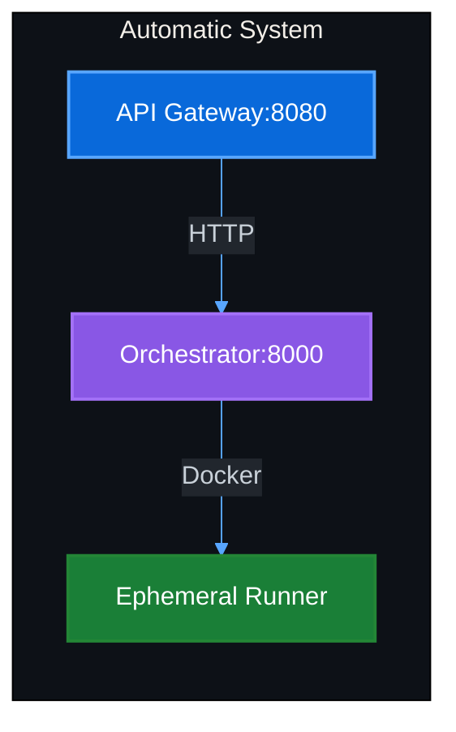
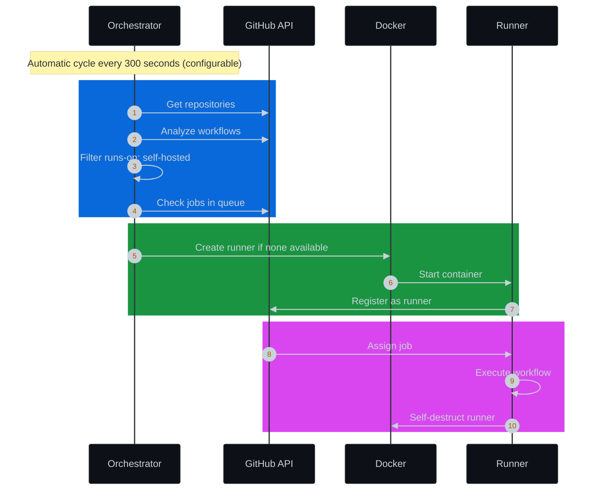

# GitHub Actions Ephemeral Runners

Platform for creating and destroying GitHub Actions self-hosted runners in an **EPHEMERAL and AUTOMATIC** way using Docker containers.

## 🚀 Key Features

- **🏗️ Modular Architecture**: API Gateway + Orchestrator + Runners
- **🤖 Automatic**: Discovers repos and creates runners without manual configuration
- **🔄 Ephemeral**: Create → Use → Destroy automatically
- **🔒 Secure**: Temporary tokens, no persistence of sensitive data
- **📈 Scalable**: Mass creation of runners on demand
- **🚀 Deploy-Ready**: Centralized configuration in deploy/

## 🏗️ Architecture



### Components

1. **API Gateway** (8080): Public HTTP entry point, validation and rate limiting
2. **Orchestrator** (8000): Internal runner management, discovery and lifecycle  
3. **Runner**: Ephemeral container that executes jobs and self-destructs

### Data Flow
```
Client → API Gateway → Orchestrator → Docker → Runner
```

## 📁 Project Structure

```
gha-ephemeral-runners/
├── deploy/                    # Deployment configuration
│   ├── compose.yaml          # Docker Compose
│   └── .env.example           # Environment variables
├── api-gateway/               # Gateway Service (8080)
│   ├── docker/               # Dockerfile and healthcheck
│   ├── scripts/              # Service scripts
│   ├── src/                  # Source code
│   ├── docs/                 # Service documentation
│   └── version.py           # Service version
├── orchestrator/              # Orchestrator Service (8000)
│   ├── docker/               # Dockerfile and healthcheck
│   ├── scripts/              # Service scripts
│   ├── src/                  # Source code
│   └── version.py           # Service version
├── LICENSE                    # MIT License
└── README.md                  # Documentation
```

## 🔑 GitHub Token (Required)

### Required Scopes

- **`repo`** - Full access to repositories
- **`admin:org`** - Organization administration
- **`workflow`** - Execute GitHub Actions workflows

### Token Creation

1. **Go to GitHub Settings** → Developer settings → Personal access tokens → Tokens (classic)
2. **Generate New Token** → Note: "GHA Ephemeral Runners"
3. **Select Scopes**: `repo`, `admin:org`, `workflow`
4. **Generate and Copy** the token immediately

### Configuration

```bash
# In deploy/.env
GITHUB_RUNNER_TOKEN=ghp_your_personal_access_token_here
```

## 🚀 Quick Start

### Automatic Mode

1. **Configure required variables**:
   ```bash
   cd deploy
   cp .env.example .env
   ```

2. **Edit .env with required values**:
   ```bash
   GITHUB_RUNNER_TOKEN=ghp_your_token_here
   RUNNER_IMAGE=myoung34/github-runner:latest
   REGISTRY=localhost
   IMAGE_VERSION=latest
   AUTO_CREATE_RUNNERS=true
   ```

3. **Start system**:
   ```bash
   docker compose up -d
   ```

4. **Verify operation**:
   - API Gateway: http://localhost:8080/health
   - Orchestrator: http://localhost:8000/health

**Ready! The system will automatically discover all your repos and create runners when needed.**

## ⚙️ Environment Variables

### Required Variables
- `GITHUB_RUNNER_TOKEN`: GitHub token for runner management
- `REGISTRY`: Your registry URL (localhost for development)
- `IMAGE_VERSION`: Image version (latest for development)
- `RUNNER_IMAGE`: Docker image for runners

### Automation Configuration
- `AUTO_CREATE_RUNNERS`: Enable automatic creation (true/false, default: false)
- `RUNNER_CHECK_INTERVAL`: Check interval in seconds (default: 300)
- `RUNNER_PURGE_INTERVAL`: Inactive runner purge interval (default: 300)
- `DISCOVERY_MODE`: Discovery mode (all/organization, default: all)

### Logging Configuration
- `LOG_LEVEL`: Logging level (DEBUG/INFO/WARNING/ERROR/CRITICAL, default: INFO)
- `LOG_VERBOSE`: Verbose mode with additional details (true/false, default: false)

### Port Configuration

- `API_GATEWAY_PORT`: Internal API Gateway port (default: 8080)
- `ORCHESTRATOR_PORT`: Internal Orchestrator port (default: 8000)

**Note**: To change external ports, modify `deploy/compose.yaml`:
```bash
# Example: change host port to 9000
# ports:
#   - "9000:8080"
```

### Variables for Runners
Variables with `runnerenv_` prefix are automatically passed to runner containers:

```bash
# Basic variables (example for myoung34/github-runner)
runnerenv_REPO_URL=https://github.com/{scope_name}
runnerenv_RUNNER_TOKEN={registration_token}
runnerenv_RUNNER_NAME={runner_name}
runnerenv_RUNNER_WORKDIR=/tmp/github-runner-{repo_owner}-{repo_name}
runnerenv_LABELS=self-hosted,ephemeral,orchestrator-{hostname}
```

#### Available Placeholders
- `{scope_name}`: Repository/organization name
- `{runner_name}`: Unique runner name
- `{registration_token}`: Registration token
- `{repo_owner}`, `{repo_name}`: Repository components
- `{timestamp}`, `{hostname}`, `{orchestrator_id}`: System and time

## 🌐 Infrastructure Requirements

- **Ports**: API Gateway (8080 exposed), Orchestrator (8000 internal) - API Gateway accessible from host, Orchestrator only on internal network
- **Proxy**: Required reverse proxy (nginx/traefik) for public exposure
- **NAT**: Can operate behind NAT without published ports
- **Docker**: Engine 20.10+ with overlay network support

## 🔄 Version Management and Build

### Build Scripts

Each service has its own independent scripts:

```bash
# API Gateway
cd api-gateway/scripts
./build.sh [registry] [container_version]    # Docker build - container version
./versioning.sh [api-gateway_version]         # Update version.py - service version

# Orchestrator  
cd orchestrator/scripts
./build.sh [registry] [container_version]    # Docker build - container version
./versioning.sh [orchestrator_version]         # Update version.py - service version
```

### Integrated CI/CD

The workflow automatically injects the version at build time:

```yaml
# .github/workflows/build-and-release.yml
build-args: APP_VERSION=${{ github.ref_name }}
```

**Results:**
- **Docker labels**: `version=1.1.0` dynamic
- **API responses**: Correct version in health checks
- **Consistency**: Same system in development and production

### Usage Examples

```bash
# Update versions
cd api-gateway/scripts && ./versioning.sh 1.2.0
cd orchestrator/scripts && ./versioning.sh 1.2.0

# Build with defaults
./build.sh

# Build with specific values
./build.sh myreg.com 1.2.0

# Build with environment variables
REGISTRY=myreg.com IMAGE_VERSION=1.2.0 ./build.sh

# Create release
git tag v1.2.0
git push origin v1.2.0
```

## 🌐 Network and Proxy Configuration

### Port Exposure

The system only exposes the API Gateway port:

```bash
# API Gateway: http://localhost:8080 (exposed)
# Orchestrator: http://orchestrator:8000 (internal network only)
```

**Port configuration:**
```yaml
# deploy/compose.yaml
ports:
  - "8080:8080"  # Only API Gateway exposed to host
  # Orchestrator only on internal gha-network
```

**Note**: The Orchestrator operates only on the internal `gha-network` and is not accessible from the host. For specific cases, you can use the internal variable `ORCHESTRATOR_PORT` (default: 8000) for custom configurations.

### Local Usage and Internal Access (Development)

For local development or internal use, direct access to the API Gateway:

```bash
# Direct access without proxy
http://<IP>:8080

# For internal use with custom port
http://<IP>:9000  # Modify deploy/compose.yaml
```

**Configuration for internal use:**
```yaml
# Modify deploy/compose.yaml for internal use
ports:
  - "9000:8080"  # Custom internal port
  # No public exposure
```

### Proxy Configuration (Production)

For production deployment with custom domain:

**1. Proxy Host**
- **Domain**: `gha.yourdomain.com`
- **Scheme**: `http`
- **Forward Hostname/IP**: `localhost`
- **Forward Port**: `8080`

**2. SSL Certificate**
- Enable SSL Certificate
- Select Let's Encrypt certificate

**3. CORS Configuration**
```bash
# In deploy/.env for production with specific domain
CORS_ORIGINS=https://yourdomain.com

# For local development/network (accepts any origin)
CORS_ORIGINS=*
```

## 🌐 Available Endpoints

- **API Gateway**: `https://gha.yourdomain.com`
- **API Docs**: `https://gha.yourdomain.com/docs` (Swagger/OpenAPI)
- **ReDoc**: `https://gha.yourdomain.com/redoc` (alternative documentation)
- **Health Check**: `https://gha.yourdomain.com/health`

**Main API Gateway endpoints:**
- `GET /health` - Complete health check
- `GET /docs` - Swagger/OpenAPI documentation
- `GET /redoc` - Alternative documentation
- `GET /runners` - List active runners
- `GET /runners/{id}` - Specific runner status
- `POST /api/v1/runners` - Create new runner
- `DELETE /api/v1/runners/{id}` - Destroy runner

## 🎯 Workflow Usage

```yaml
# .github/workflows/ci.yml
name: CI
on: [push, workflow_dispatch]

jobs:
  build:
    runs-on: self-hosted  # ← Runner created automatically or manually
    steps:
      - uses: actions/checkout@v5
      - name: Build and Test
        run: |
          echo "Running on ephemeral runner!"
          # your build/test commands
```

## 🔧 Custom Runner Commands
The `RUNNER_COMMAND` variable (from orchestrator) allows directly injecting a command that replaces the container's default CMD. Allows creative uses to create or execute scripts from a volume mounted in orchestrator.

```bash
# Workaround to eliminate pip warning in actions/setup-python
RUNNER_COMMAND=bash -c "d=/tmp/h/ensurepip;mkdir -p $$d;printf '__all__=[\"bootstrap\"]\ndef bootstrap(*a,**k):0'>$$d/__init__.py;printf 'import sys;sys.exit(0)'>$$d/__main__.py;PYTHONPATH=/tmp/h exec ./bin/Runner.Listener run --startuptype service"
```

### Execution Order
**ENTRYPOINT executes first, RUNNER_COMMAND overwrites the Docker build CMD.**

```mermaid
%%{init: {
  'theme': 'base',
  'themeVariables': {
    'primaryColor': '#0d1117',
    'primaryTextColor': '#c9d1d9',
    'primaryBorderColor': '#30363d',
    'lineColor': '#58a6ff',
    'sectionBkgColor': '#0d1117',
    'altSectionBkgColor': '#0d1117',
    'gridColor': '#0d1117',
    'secondaryColor': '#238636',
    'tertiaryColor': '#0d1117',
    'edgeLabelBackground': '#21262d',
    'edgeLabelBorderColor': '#58a6ff',
    'edgeLabelTextColor': '#c9d1d9'
  }
}}%%
graph LR
    A[Container Start] --> B[entrypoint.sh]
    B --> C[Configure runner]
    C --> D{RUNNER_COMMAND?}
    
    D -->|Yes| E[RUNNER_COMMAND<br/>Overwrites CMD]
    D -->|No| F[Default CMD<br/>Runner.Listener run]
    
    E --> G[Defined processes<br/>Runner.Listener, filtering]
    F --> H[Runner.Listener<br/>Executes GitHub Actions]
    
    G --> I[GitHub Actions]
    H --> I
    
    I --> J[Job End]
    J --> K[Container Destruction]
    
    style A fill:#0d1117,stroke:#30363d,stroke-width:2px,color:#c9d1d9
    style B fill:#0d1117,stroke:#30363d,stroke-width:2px,color:#c9d1d9
    style D fill:#d97f00,stroke:#fb8500,stroke-width:2px,color:#ffffff
    style E fill:#1a7f37,stroke:#238636,stroke-width:2px,color:#ffffff
    style F fill:#8957e5,stroke:#a371f7,stroke-width:2px,color:#ffffff
    style I fill:#1a7f37,stroke:#238636,stroke-width:2px,color:#ffffff
    style K fill:#0d1117,stroke:#30363d,stroke-width:2px,color:#c9d1d9
```



**Notes**: 
- Orchestrator variable that directly replaces the container's CMD. If you don't specify RUNNER_COMMAND, the default CMD is used if it exists.
- **Default GitHub Actions Runner CMD**: `["./bin/Runner.Listener", "run", "--startuptype", "service"]`

### ⚠️ Note on pip Warning
Self-hosted runners may display a warning about "Running pip as root" when using `actions/setup-python@v*`. This is a known bug that does not affect functionality.

## 📊 Standardized Logging

### Category System

The system uses emoji categories for consistency throughout the architecture:

```python
LOG_CATEGORIES = {
    'START': '🚀 START',
    'CONFIG': '⚙️ CONFIG', 
    'MONITOR': '🔄 MONITOR',
    'SUCCESS': '✅ SUCCESS',
    'ERROR': '❌ ERROR',
    'WARNING': '⚠️ WARNING',
    'INFO': '📋 INFO',
    'REQUEST': '🌐 REQUEST',
    'RESPONSE': '📤 RESPONSE',
    'HEALTH': '💚 HEALTH',
    'SHUTDOWN': '🛑 SHUTDOWN'
}
```

### Optimized Middleware

- **Internal health checks**: No REQUEST/RESPONSE logs to reduce noise
- **External requests**: Complete logging with standardized format
- **Consistency**: Same format in API Gateway and Orchestrator

**Log examples:**
```
🚀 START API Gateway Service
⚙️ CONFIG Orchestrator configured: http://orchestrator:8000
🌐 REQUEST Request received: POST http://localhost:8080/api/v1/runners - IP: 192.168.1.100
📤 RESPONSE Response sent: Status: 201 - Duration: 0.245s
💚 HEALTH Gateway working correctly
```

## 🤖 Automatic Mode: Intelligent Discovery

### How It Works

The system automatically discovers all your repositories and creates runners when needed:



## 🔒 Security

- **Temporary tokens**: Registration tokens with fast expiration
- **Isolation**: Runners in isolated Docker containers
- **No persistence**: No sensitive tokens stored

## 📄 License

MIT License - see LICENSE file for details.
