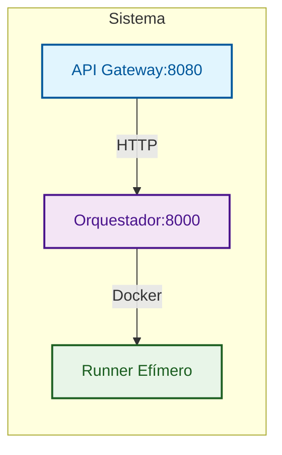
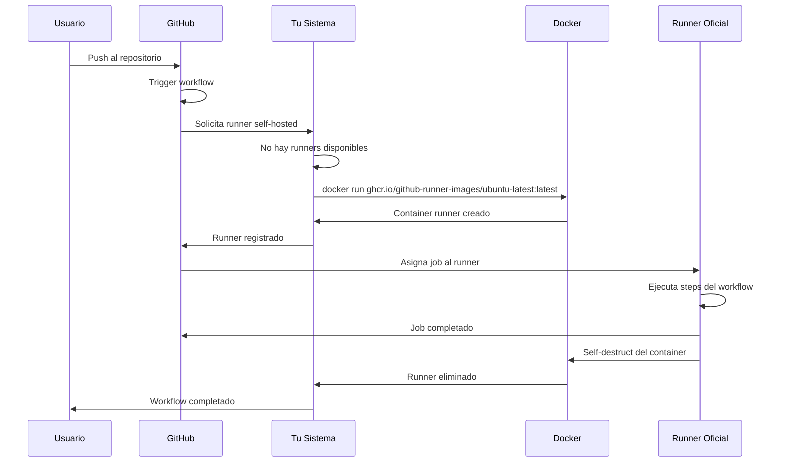

# GitHub Actions Ephemeral Runners

Plataforma para crear y destruir runners self-hosted de GitHub Actions de forma EFIMERA usando contenedores Docker.

## Características

- **Efímeros**: Crear -> Usar -> Destruir automáticamente
- **Seguros**: Tokens temporales, sin persistencia de datos sensibles
- **Escalables**: Creación masiva de runners bajo demanda
- **Minimalistas**: Sin monitoreo ni métricas innecesarias
- **Repo-first**: Despliegue sin infraestructura previa
- **Registry-ready**: Compatible con registry privado

## Arquitectura



### Componentes

1. **API Gateway**: Punto de entrada HTTP, autenticación y rate limiting
2. **Orquestador**: Genera tokens, crea contenedores, gestiona ciclo de vida
3. **Runner**: Contenedor efímero que ejecuta jobs y se autodestruye

## [Rocket] Inicio Rápido

### Requisitos Mínimos

- Docker y Docker Compose
- Token de GitHub con scopes: `repo`, `admin:org`, `workflow`
- Registry privado con imágenes: `gha-orchestrator`, `gha-api-gateway`

### 4 Pasos para Empezar

1. **Configurar token**:
   ```bash
   echo "GITHUB_TOKEN=ghp_tu_token" > .env
   ```

2. **Configurar registry**:
   ```bash
   echo "REGISTRY=your-registry.com" >> .env
   echo "IMAGE_VERSION=latest" >> .env
   ```

3. **Inicia el sistema**:
   ```bash
   docker compose up -d
   ```

4. **Verificar funcionamiento**:
   ```bash
   curl http://localhost:8080/health
   ```

**Opcional: Configurar puerto personalizado**
```bash
# Si quieres usar un puerto diferente al 8080, edita docker-compose.yml:
# ports:
#   - "8090:8080"  # Cambia 8090 al puerto que desees

docker compose up -d
curl http://localhost:8080/health
```

5. **Usar en tu workflow**:
   ```yaml
   # .github/workflows/ci.yml
   name: CI
   on: [push]
   jobs:
     build:
       runs-on: self-hosted  # <- ¡Esto es todo!
       steps:
       - uses: actions/checkout@v4
       - run: echo "Running on ephemeral runner!"
   ```

6. **Hacer push y ver la magia**:
   ```bash
   git push origin main
   ```

## [Package] Instalación Completa

### Opción 1: Usando imágenes del Registry (Recomendado)

1. **Clonar repositorio**:
   ```bash
   git clone <repository-url>
   cd gha-ephemeral-runners
   ```

2. **Configurar variables de entorno**:
   ```bash
   cp .env.example .env
   # Editar .env con tu configuración:
   # - GITHUB_TOKEN: Token de GitHub
   # - REGISTRY: Tu registry privado
   # - IMAGE_VERSION: Versión de imágenes (requerido)
   ```

3. **Desplegar**:
   ```bash
   docker compose up -d
   ```

### Opción 2: Build local

1. **Configurar variables de entorno**:
   ```bash
   cp .env.example .env
   # Editar .env con tu configuración:
   # - REGISTRY: Tu registry privado
   # - IMAGE_VERSION: Versión de imágenes (requerido)
   ```

2. **Construir imágenes**:
   ```bash
   # Precondición: docker login your-registry.com
   python build_and_push.py
   ```

## [Tool] Token de GitHub

### ¿Qué tipo de token necesitas?

**Personal Access Token (PAT)** con los siguientes scopes:
- `repo` - Acceso completo a repositorios
- `admin:org` - Administración de organización
- `workflow` - Ejecutar workflows de GitHub Actions

### ¿Cómo obtener el token?

1. **Ve a GitHub Settings** -> Developer settings -> Personal access tokens -> Tokens (classic)
2. **Generate New Token** -> Note: "GHA Ephemeral Runners"
3. **Seleccionar Scopes**: `repo`, `admin:org`, `workflow`
4. **Generate y Copiar** el token inmediatamente

### Uso del Token

```bash
# En tu .env
GITHUB_TOKEN=ghp_tu_personal_access_token_aqui
```

**El sistema usa tu PAT para:**
1. Generar tokens temporales para cada runner
2. Registrar runners en GitHub
3. Gestionar ciclo de vida completo

**Seguridad:**
- Tu PAT solo existe en el orquestador
- Los runners usan tokens temporales
- Sin persistencia en logs o imágenes
- Puedes rotar tu PAT sin afectar runners activos

## [Target] Uso Práctico

### Conectar tu Repositorio

#### Para Repositorio Específico

1. **Ve a tu repositorio en GitHub**
2. **Settings -> Actions -> Runners** (verás "No self-hosted runners")
3. **Crea workflow** `.github/workflows/ci.yml`:
   ```yaml
   name: CI/CD
   on:
     push:
       branches: [ main ]
   jobs:
     build:
       runs-on: self-hosted
       steps:
       - uses: actions/checkout@v4
       - name: Build
         run: echo "Running on ephemeral runner!"
   ```

#### Para Organización

1. **Ve a tu organización en GitHub**
2. **Settings -> Actions -> Runner groups** -> Crea nuevo grupo
3. **Asigna repositorios al grupo**
4. **Usa `runs-on: self-hosted` en workflows**

### ¿Qué sucede cuando haces push?



### Verificación

```bash
# Ver runners activos
curl http://localhost:8080/api/v1/runners

# Ver salud del sistema
curl http://localhost:8080/api/v1/health

# Ver logs
docker compose logs -f orchestrator
```

## [API] Endpoints

### API Gateway (Puerto 8080)
| Endpoint | Método | Descripción |
|----------|--------|-------------|
| `/api/v1/runners` | POST | Crear runners efímeros |
| `/api/v1/runners` | GET | Listar todos los runners activos |
| `/api/v1/runners/{id}` | GET | Ver estado de un runner específico |
| `/api/v1/runners/{id}` | DELETE | Destruir un runner específico |
| `/api/v1/runners/cleanup` | POST | Limpiar runners inactivos |
| `/health` | GET | Health check básico |
| `/api/v1/health` | GET | Health check completo |
| `/docs` | GET | Documentación Swagger UI |
| `/redoc` | GET | Documentación ReDoc |

### Orquestador (Puerto 8000)
| Endpoint | Método | Descripción |
|----------|--------|-------------|
| `/runners/create` | POST | Crear runners efímeros |
| `/runners` | GET | Listar todos los runners activos |
| `/runners/{id}/status` | GET | Ver estado de un runner específico |
| `/runners/{id}` | DELETE | Destruir un runner específico |
| `/runners/cleanup` | POST | Limpiar runners inactivos |
| `/health` | GET | Health check con estado de runners |

### Health Checks
Los servicios incluyen health checks nativos en Go compilados:
- **API Gateway**: `/healthz` (Docker), `/health` (básico), `/api/v1/health` (completo)
- **Orquestador**: `/healthz` (Docker), `/health` (con runners)

## [Lock] Configuración Avanzada

### Configuración de Puertos

Puedes configurar el puerto del host para el API Gateway según tus necesidades:

```bash
# Sin configurar (usa default 8080)
docker compose up -d

# Para cambiar puerto, edita docker-compose.yml y cambia:
# ports:
#   - "8090:8080"  # Puerto personalizado
```

**Ejemplos de uso:**
```bash
# Verificar salud del sistema (puerto default)
curl http://localhost:8080/health

# Verificar salud del sistema (puerto personalizado)
curl http://localhost:8083/health
```

### Nginx Proxy Manager (Producción)

Para producción, usa Nginx Proxy Manager:

1. **Configurar Proxy Host**:
   - Domain: `gha.yourdomain.com`
   - Forward Port: `8080`
   - SSL Certificate: Habilitar

2. **Configurar .env**:
   ```bash
   # Para producción con dominio específico
   CORS_ORIGINS=https://yourdomain.com
   
   # Para desarrollo local/red (acepta cualquier origen)
   # CORS_ORIGINS=*
   ```

### Variables de Entorno

#### Obligatorias
- `GITHUB_TOKEN`: Token de GitHub con permisos
- `REGISTRY`: URL de tu registry privado
- `IMAGE_VERSION`: Versión de imágenes

#### Opcionales
- `CORS_ORIGINS`: Orígenes permitidos para CORS (default: "*" - acepta cualquier origen)
- `API_GATEWAY_PORT`: Puerto interno del contenedor API Gateway (default: 8080)
- `ORCHESTRATOR_PORT`: Puerto interno del contenedor Orchestrator (default: 8000)

> **Nota**: Las variables `API_GATEWAY_PORT` y `ORCHESTRATOR_PORT` están configuradas en .env.example. `ORCHESTRATOR_URL` se construye dinámicamente usando `http://orchestrator:${ORCHESTRATOR_PORT}`.

### Build y Push de Imágenes

### Uso Local con Script Python

Para desarrollo local, usa el script `build_and_push.py`. El script lee las variables del archivo `.env` en la raíz del repositorio (el mismo que usa Docker Compose):

```bash
# Precondición: docker login your-registry.com

# Configurar .env (si no existe)
cp .env.example .env
# Editar .env con:
# - REGISTRY=your-registry.com
# - IMAGE_VERSION=v1.2.3

# Build y push
python build_and_push.py

# Simular ejecución
python build_and_push.py --dry-run

# Con limpieza de imágenes
python build_and_push.py --cleanup
```

### GitHub Actions CI/CD

El workflow `build-and-push.yml` automatiza la construcción y publicación:

- **Trigger**: Tags `vX.Y.Z`
- **Build**: Construye 2 imágenes Docker para `linux/amd64`
- **Tags**: `:latest` y `:versión` (dual tagging)
- **Health Checks**: Verifica endpoints nativos Go

#### Configuración Requerida
- **Repository Variables**: `REGISTRY=your-registry.com`
- **Repository Secrets**: `REGISTRY_USERNAME`, `REGISTRY_PASSWORD`
- **Permisos**: `contents: read`, `packages: write`

#### Flujo CI/CD
1. Push tag `v1.2.3` → Trigger automático
2. Login registry → Build images → Push con tags
3. Health checks → Verificación de endpoints

### Imágenes Construidas

```bash
your-registry.com/gha-orchestrator:latest
your-registry.com/gha-orchestrator:v1.2.3

your-registry.com/gha-api-gateway:latest
your-registry.com/gha-api-gateway:v1.2.3
```

### Health Checks
Los servicios incluyen health checks nativos en Go compilados:
- **API Gateway**: `/healthz` (Docker), `/health` (básico), `/api/v1/health` (completo)
- **Orquestador**: `/healthz` (Docker), `/health` (con runners)

## [Secure] Seguridad

- **Tokens temporales**: Los registration tokens expiran rápidamente
- **Sin persistencia**: Ningún token sensible persiste en contenedores
- **Aislamiento**: Cada runner es un contenedor aislado
- **Autenticación opcional**: API Gateway puede requerir API key

## [Doc] Licencia

MIT License - ver archivo LICENSE para detalles.
# Updated workflows trigger patterns
