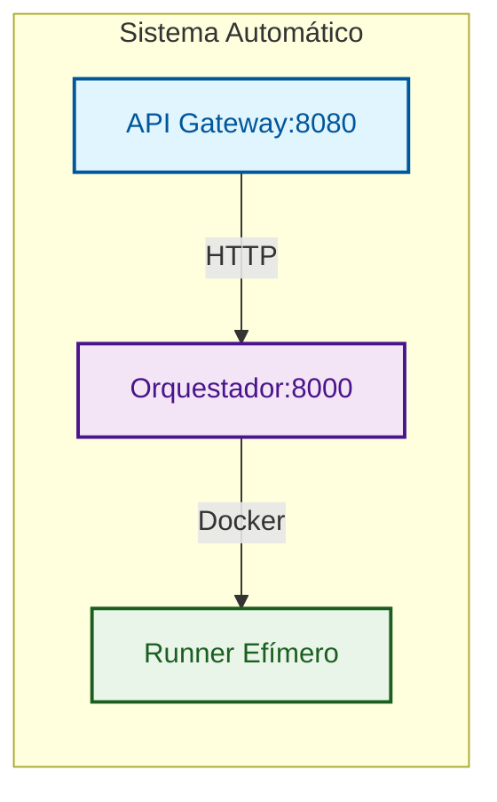

# GitHub Actions Ephemeral Runners

Plataforma para crear y destruir runners self-hosted de GitHub Actions de forma **EFIMERA y AUTOMÁTICA** usando contenedores Docker.

## 🚀 Características Principales

- **🏗️ Arquitectura Modular**: API Gateway + Orchestrator + Runners
- **🤖 Automático**: Descubre repos y crea runners sin configuración manual
- **🔄 Efímeros**: Crear → Usar → Destruir automáticamente
- **🔒 Seguros**: Tokens temporales, sin persistencia de datos sensibles
- **📈 Escalables**: Creación masiva de runners bajo demanda
- **🚀 Deploy-Ready**: Configuración centralizada en deploy/

## 🏗️ Arquitectura



### Componentes

1. **API Gateway** (8080): Punto de entrada HTTP público, validación y rate limiting
2. **Orquestador** (8000): Gestión interna de runners, descubrimiento y ciclo de vida  
3. **Runner**: Contenedor efímero que ejecuta jobs y se autodestruye

### Flujo de Datos
```
Cliente → API Gateway → Orquestador → Docker → Runner
```

## 📁 Estructura del Proyecto

```
gha-ephemeral-runners/
├── deploy/                    # Configuración de despliegue
│   ├── compose.yaml          # Docker Compose
│   └── .env.example           # Variables de entorno
├── api-gateway/               # Servicio Gateway (8080)
│   ├── docker/               # Dockerfile y healthcheck
│   ├── scripts/              # Scripts del servicio
│   ├── src/                  # Código fuente
│   ├── docs/                 # Documentación del servicio
│   └── version.py           # Versión del servicio
├── orchestrator/              # Servicio Orchestrator (8000)
│   ├── docker/               # Dockerfile y healthcheck
│   ├── scripts/              # Scripts del servicio
│   ├── src/                  # Código fuente
│   └── version.py           # Versión del servicio
├── LICENSE                    # Licencia MIT
└── README.md                  # Documentación
```

## 🚀 Inicio Rápido

### Modo Automático

1. **Configurar variables obligatorias**:
   ```bash
   cd deploy
   cp .env.example .env
   ```

2. **Editar .env con valores requeridos**:
   ```bash
   GITHUB_RUNNER_TOKEN=ghp_tu_token_aqui
   RUNNER_IMAGE=myoung34/github-runner:latest
   REGISTRY=localhost
   IMAGE_VERSION=latest
   AUTO_CREATE_RUNNERS=true
   ```

3. **Iniciar sistema**:
   ```bash
   docker compose up -d
   ```

4. **Verificar funcionamiento**:
   - API Gateway: http://localhost:8080/health
   - Orchestrator: http://localhost:8000/health

**¡Listo! El sistema descubrirá automáticamente todos tus repos y creará runners cuando se necesiten.**

## ⚙️ Variables de Entorno

### Variables Obligatorias
- `GITHUB_RUNNER_TOKEN`: Token de GitHub para gestión de runners
- `REGISTRY`: URL de tu registry (localhost para desarrollo)
- `IMAGE_VERSION`: Versión de imágenes (latest para desarrollo)
- `RUNNER_IMAGE`: Imagen Docker para runners

### Configuración de Automatización
- `AUTO_CREATE_RUNNERS`: Activar creación automática (true/false, default: false)
- `RUNNER_CHECK_INTERVAL`: Intervalo de verificación en segundos (default: 300)
- `RUNNER_PURGE_INTERVAL`: Intervalo de purga de runners inactivos (default: 300)
- `DISCOVERY_MODE`: Modo de descubrimiento (all/organization, default: all)

### Configuración de Logging
- `LOG_LEVEL`: Nivel de logging (DEBUG/INFO/WARNING/ERROR/CRITICAL, default: INFO)
- `LOG_VERBOSE`: Modo verbose con detalles adicionales (true/false, default: false)

### Configuración de Puertos

- `API_GATEWAY_PORT`: Puerto interno del API Gateway (default: 8080)
- `ORCHESTRATOR_PORT`: Puerto interno del Orchestrator (default: 8000)

**Nota**: Para cambiar puertos externos, modifica `deploy/compose.yaml`:
```bash
# Ejemplo: cambiar puerto host a 9000
# ports:
#   - "9000:8080"
```

### Variables para Runners
Las variables con prefijo `runnerenv_` se pasan automáticamente a los contenedores de runners:

```bash
# Variables básicas (ejemplo para myoung34/github-runner)
runnerenv_REPO_URL=https://github.com/{scope_name}
runnerenv_RUNNER_TOKEN={registration_token}
runnerenv_RUNNER_NAME={runner_name}
runnerenv_RUNNER_WORKDIR=/tmp/github-runner-{repo_owner}-{repo_name}
runnerenv_LABELS=self-hosted,ephemeral,orchestrator-{hostname}
```

#### Placeholders Disponibles
- `{scope_name}`: Nombre del repositorio/organización
- `{runner_name}`: Nombre único del runner
- `{registration_token}`: Token de registro
- `{repo_owner}`, `{repo_name}`: Componentes del repositorio
- `{timestamp}`, `{hostname}`, `{orchestrator_id}`: Sistema y tiempo

## 🔧 Comando Personalizado para Runners
La variable `RUNNER_COMMAND` (del orquestador) permite inyectar directamente un comando que reemplaza el CMD por defecto del contenedor:

```bash
# Ejemplo para filtrar warning de pip en actions/setup-python
RUNNER_COMMAND=bash -c "./bin/Runner.Listener run --startuptype service 2>&1 | sed '/WARNING: Running pip as the.*root.*user/d' || true"
```

### Orden de Ejecución
**ENTRYPOINT se ejecuta primero, RUNNER_COMMAND después:**

1. **entrypoint.sh** → Configura y registra el runner
2. **RUNNER_COMMAND** → Se ejecuta con control total del proceso
3. **GitHub Actions** → Se ejecuta dentro de nuestro comando

**Nota**: Variable del orquestador que reemplaza directamente el CMD del contenedor con el comando especificado, permitiendo cualquier tipo de modificación o comportamiento personalizado.

## 🌐 Requisitos de Infraestructura

- **Puertos**: API Gateway (8080 expuesto), Orchestrator (8000 interno) - API Gateway accesible desde host, Orchestrator solo en red interna
- **Proxy**: Requerido reverse proxy (nginx/traefik) para exposición pública
- **NAT**: Puede operar detrás de NAT sin puertos publicados
- **Docker**: Engine 20.10+ con soporte para redes overlay

## 🔄 Gestión de Versiones y Build

### Scripts de Build

Cada servicio tiene sus propios scripts independientes:

```bash
# API Gateway
cd api-gateway/scripts
./build.sh [registry] [container_version]    # Build Docker - versión del contenedor
./versioning.sh [api-gateway_version]         # Actualizar version.py - versión del servicio

# Orchestrator  
cd orchestrator/scripts
./build.sh [registry] [container_version]    # Build Docker - versión del contenedor
./versioning.sh [orchestrator_version]         # Actualizar version.py - versión del servicio
```

### CI/CD Integrado

El workflow inyecta automáticamente la versión en build time:

```yaml
# .github/workflows/build-and-release.yml
build-args: APP_VERSION=${{ github.ref_name }}
```

**Resultados:**
- **Docker labels**: `version=1.1.0` dinámico
- **API responses**: Versión correcta en health checks
- **Consistencia**: Mismo sistema en desarrollo y producción

### Ejemplos de Uso

```bash
# Actualizar versiones
cd api-gateway/scripts && ./versioning.sh 1.2.0
cd orchestrator/scripts && ./versioning.sh 1.2.0

# Build con defaults
./build.sh

# Build con valores específicos
./build.sh myreg.com 1.2.0

# Build con variables de entorno
REGISTRY=myreg.com IMAGE_VERSION=1.2.0 ./build.sh

# Crear release
git tag v1.2.0
git push origin v1.2.0
```

## 📊 Logging Estandarizado

### Sistema de Categorías

El sistema usa categorías con emojis para consistencia en toda la arquitectura:

```python
LOG_CATEGORIES = {
    'START': '🚀 INICIO',
    'CONFIG': '⚙️ CONFIG', 
    'MONITOR': '🔄 MONITOREO',
    'SUCCESS': '✅ ÉXITO',
    'ERROR': '❌ ERROR',
    'WARNING': '⚠️ ADVERTENCIA',
    'INFO': '📋 INFO',
    'REQUEST': '🌐 REQUEST',
    'RESPONSE': '📤 RESPONSE',
    'HEALTH': '💚 HEALTH',
    'SHUTDOWN': '🛑 SHUTDOWN'
}
```

### Middleware Optimizado

- **Health checks internos**: Sin logs REQUEST/RESPONSE para reducir ruido
- **Solicitudes externas**: Logging completo con formato estandarizado
- **Consistencia**: Mismo formato en API Gateway y Orchestrator

**Ejemplos de logs:**
```
🚀 INICIO API Gateway Service
⚙️ CONFIG Orquestador configurado: http://orchestrator:8000
🌐 REQUEST Solicitud recibida: POST http://localhost:8080/api/v1/runners - IP: 192.168.1.100
📤 RESPONSE Respuesta enviada: Status: 201 - Duración: 0.245s
💚 HEALTH Gateway funcionando correctamente
```

## 🌐 Configuración de Redes y Proxy

### Exposición de Puertos

El sistema expone únicamente el puerto del API Gateway:

```bash
# API Gateway: http://localhost:8080 (expuesto)
# Orchestrator: http://orchestrator:8000 (solo red interna)
```

**Configuración de puertos:**
```yaml
# deploy/compose.yaml
ports:
  - "8080:8080"  # Solo API Gateway expuesto al host
  # Orchestrator solo en red interna gha-network
```

**Nota**: El Orchestrator opera únicamente en la red interna `gha-network` y no es accesible desde el host. Para casos específicos, puedes usar la variable interna `ORCHESTRATOR_PORT` (default: 8000) para configuraciones personalizadas.

### Uso Local y Acceso Interno (Desarrollo)

Para desarrollo local o uso interno, acceso directo al API Gateway:

```bash
# Acceso directo sin proxy
http://<IP>:8080

# Para uso interno con puerto personalizado
http://<IP>:9000  # Modificar deploy/compose.yaml
```

**Configuración para uso interno:**
```yaml
# Modificar deploy/compose.yaml para uso interno
ports:
  - "9000:8080"  # Puerto interno personalizado
  # Sin exposición pública
```

### Configuración con Proxy (Producción)

Para despliegue en producción con dominio personalizado:

**1. Proxy Host**
- **Domain**: `gha.yourdomain.com`
- **Scheme**: `http`
- **Forward Hostname/IP**: `localhost`
- **Forward Port**: `8080`

**2. SSL Certificate**
- Habilitar SSL Certificate
- Seleccionar certificado Let's Encrypt

**3. Configuración CORS**
```bash
# En deploy/.env para producción con dominio específico
CORS_ORIGINS=https://yourdomain.com

# Para desarrollo local/red (acepta cualquier origen)
CORS_ORIGINS=*
```

## 🌐 Endpoints Disponibles

- **API Gateway**: `https://gha.yourdomain.com`
- **API Docs**: `https://gha.yourdomain.com/docs` (Swagger/OpenAPI)
- **ReDoc**: `https://gha.yourdomain.com/redoc` (documentación alternativa)
- **Health Check**: `https://gha.yourdomain.com/health`

**Endpoints principales del API Gateway:**
- `GET /health` - Health check completo
- `GET /docs` - Documentación Swagger/OpenAPI
- `GET /redoc` - Documentación alternativa
- `GET /runners` - Listar runners activos
- `GET /runners/{id}` - Estado de runner específico
- `POST /api/v1/runners` - Crear nuevo runner
- `DELETE /api/v1/runners/{id}` - Destruir runner

## 🎯 Uso en Workflows

```yaml
# .github/workflows/ci.yml
name: CI
on: [push, workflow_dispatch]

jobs:
  build:
    runs-on: self-hosted  # ← Runner creado automáticamente o manualmente
    steps:
      - uses: actions/checkout@v5
      - name: Build and Test
        run: |
          echo "Running on ephemeral runner!"
          # tus comandos de build/test
```

## 🔑 Token de GitHub

### Scopes Requeridos

- **`repo`** - Acceso completo a repositorios
- **`admin:org`** - Administración de organización
- **`workflow`** - Ejecutar workflows de GitHub Actions

### Creación del Token

1. **Ve a GitHub Settings** → Developer settings → Personal access tokens → Tokens (classic)
2. **Generate New Token** → Note: "GHA Ephemeral Runners"
3. **Seleccionar Scopes**: `repo`, `admin:org`, `workflow`
4. **Generate y Copiar** el token inmediatamente

### Configuración

```bash
# En deploy/.env
GITHUB_RUNNER_TOKEN=ghp_tu_personal_access_token_aqui
```

## 🤖 Modo Automático: Descubrimiento Inteligente

### Funcionamiento

El sistema descubre automáticamente todos tus repositorios y crea runners cuando se necesitan:

```mermaid
%%{init: {
  "theme": "dark",
  "themeVariables": {
    "fontFamily": "Inter, Segoe UI, Arial",
    "fontSize": "14px",
    "primaryTextColor": "#EAEAEA",
    "lineColor": "#9CA3AF",
    "noteTextColor": "#EAEAEA",
    "noteBkgColor": "#1F2937",
    "noteBorderColor": "#374151",
    "actorBkg": "#020617",
    "actorBorder": "#475569"
  }
}}%%

sequenceDiagram
    autonumber

    participant ORQ as Orchestrator
    participant GH as GitHub API
    participant DOCKER as Docker
    participant RUN as Runner

    Note over ORQ: Ciclo automático cada 300 segundos (configurable)

    rect rgb(30,58,138)
        ORQ->>GH: Obtener repositorios
        ORQ->>GH: Analizar workflows
        ORQ->>ORQ: Filtrar runs-on: self-hosted
        ORQ->>GH: Verificar jobs en cola
    end

    rect rgb(11,58,74)
        ORQ->>DOCKER: Crear runner si no hay disponible
        DOCKER->>RUN: Iniciar contenedor
        RUN->>GH: Registrarse como runner
    end

    rect rgb(20,83,45)
        GH->>RUN: Asignar job
        RUN->>RUN: Ejecutar workflow
        RUN->>DOCKER: Autodestruir runner
    end
```



## 🔒 Seguridad

- **Tokens temporales**: Registration tokens con expiración rápida
- **Aislamiento**: Runners en contenedores Docker aislados
- **Sin persistencia**: No se almacenan tokens sensibles

## 📄 Licencia

MIT License - ver archivo LICENSE para detalles.
