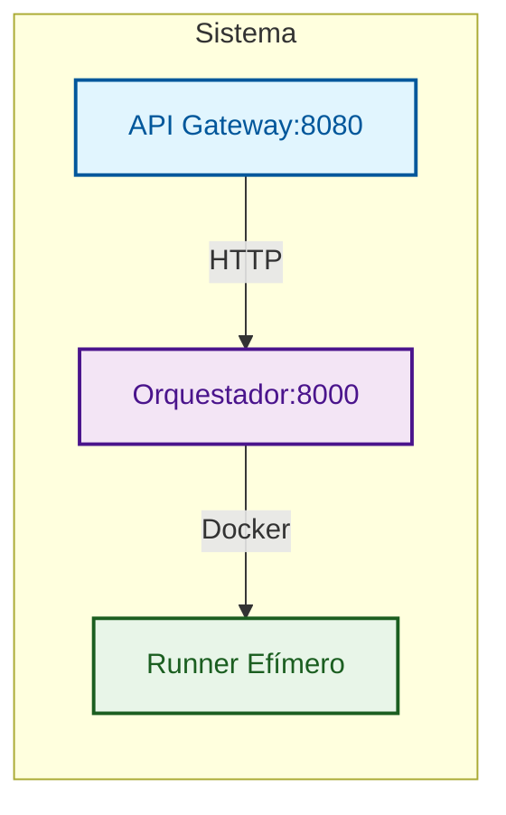
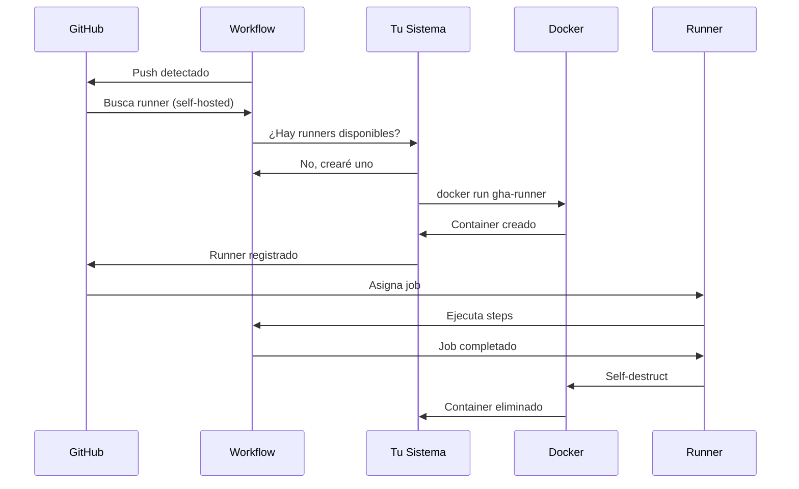

# GitHub Actions Ephemeral Runners

Plataforma para crear y destruir runners self-hosted de GitHub Actions de forma EFIMERA usando contenedores Docker.

## Características

- **Efímeros**: Crear -> Usar -> Destruir automáticamente
- **Seguros**: Tokens temporales, sin persistencia de datos sensibles
- **Escalables**: Creación masiva de runners bajo demanda
- **Minimalistas**: Sin monitoreo ni métricas innecesarias
- **Repo-first**: Despliegue sin infraestructura previa
- **Registry-ready**: Compatible con registry privado

## Arquitectura



### Componentes

1. **API Gateway**: Punto de entrada HTTP, autenticación y rate limiting
2. **Orquestador**: Genera tokens, crea contenedores, gestiona ciclo de vida
3. **Runner**: Contenedor efímero que ejecuta jobs y se autodestruye

## [Rocket] Inicio Rápido

### Requisitos Mínimos

- Docker y Docker Compose
- Token de GitHub con scopes: `repo`, `admin:org`, `workflow`
- Registry privado con imágenes: `gha-runner`, `gha-orchestrator`, `gha-api-gateway`

### 4 Pasos para Empezar

1. **Configurar token**:
   ```bash
   echo "GITHUB_TOKEN=ghp_tu_token" > .env
   ```

2. **Configurar registry**:
   ```bash
   echo "REGISTRY=your-registry.com" >> .env
   echo "IMAGE_VERSION=v1.2.3" >> .env
   ```

3. **Inicia el sistema**:
   ```bash
   docker compose up -d
   ```

4. **Verificar funcionamiento**:
   ```bash
   curl http://localhost:8080/health
   ```

5. **Usar en tu workflow**:
   ```yaml
   # .github/workflows/ci.yml
   name: CI
   on: [push]
   jobs:
     build:
       runs-on: self-hosted  # <- ¡Esto es todo!
       steps:
       - uses: actions/checkout@v4
       - run: echo "Running on ephemeral runner!"
   ```

6. **Hacer push y ver la magia**:
   ```bash
   git push origin main
   ```

## [Package] Instalación Completa

### Opción 1: Usando imágenes del Registry (Recomendado)

1. **Clonar repositorio**:
   ```bash
   git clone <repository-url>
   cd gha-ephemeral-runners
   ```

2. **Configurar variables de entorno**:
   ```bash
   cp .env.example .env
   # Editar .env con tu configuración:
   # - GITHUB_TOKEN: Token de GitHub
   # - REGISTRY: Tu registry privado
   # - IMAGE_VERSION: Versión de imágenes (requerido)
   ```

3. **Desplegar**:
   ```bash
   docker compose up -d
   ```

### Opción 2: Build local

1. **Configurar variables de entorno**:
   ```bash
   cp .env.example .env
   # Editar .env con tu configuración:
   # - REGISTRY: Tu registry privado
   # - IMAGE_VERSION: Versión de imágenes (requerido)
   ```

2. **Construir imágenes**:
   ```bash
   # Precondición: docker login your-registry.com
   python build_and_push.py
   ```

## [Tool] Token de GitHub

### ¿Qué tipo de token necesitas?

**Personal Access Token (PAT)** con los siguientes scopes:
- `repo` - Acceso completo a repositorios
- `admin:org` - Administración de organización
- `workflow` - Ejecutar workflows de GitHub Actions

### ¿Cómo obtener el token?

1. **Ve a GitHub Settings** -> Developer settings -> Personal access tokens -> Tokens (classic)
2. **Generate New Token** -> Note: "GHA Ephemeral Runners"
3. **Seleccionar Scopes**: `repo`, `admin:org`, `workflow`
4. **Generate y Copiar** el token inmediatamente

### Uso del Token

```bash
# En tu .env
GITHUB_TOKEN=ghp_tu_personal_access_token_aqui
```

**El sistema usa tu PAT para:**
1. Generar tokens temporales para cada runner
2. Registrar runners en GitHub
3. Gestionar ciclo de vida completo

**Seguridad:**
- Tu PAT solo existe en el orquestador
- Los runners usan tokens temporales
- Sin persistencia en logs o imágenes
- Puedes rotar tu PAT sin afectar runners activos

## [Target] Uso Práctico

### Conectar tu Repositorio

#### Para Repositorio Específico

1. **Ve a tu repositorio en GitHub**
2. **Settings -> Actions -> Runners** (verás "No self-hosted runners")
3. **Crea workflow** `.github/workflows/ci.yml`:
   ```yaml
   name: CI/CD
   on:
     push:
       branches: [ main ]
   jobs:
     build:
       runs-on: self-hosted
       steps:
       - uses: actions/checkout@v4
       - name: Build
         run: echo "Running on ephemeral runner!"
   ```

#### Para Organización

1. **Ve a tu organización en GitHub**
2. **Settings -> Actions -> Runner groups** -> Crea nuevo grupo
3. **Asigna repositorios al grupo**
4. **Usa `runs-on: self-hosted` en workflows**

### ¿Qué sucede cuando haces push?



### Verificación

```bash
# Ver runners activos
curl http://localhost:8080/api/v1/runners

# Ver salud del sistema
curl http://localhost:8080/api/v1/health

# Ver logs
docker compose logs -f orchestrator
```

## [API] API Reference

### [Target] Arquitectura de Endpoints

#### **Orquestador (Puerto 8000) - Motor Interno**
| Endpoint | Método | Propósito |
|----------|--------|-----------|
| `/runners/create` | POST | **Crear runners** - Genera 1-10 runners efímeros |
| `/runners/{runner_id}/status` | GET | **Ver estado** - Estado específico de un runner |
| `/runners/{runner_id}` | DELETE | **Destruir runner** - Eliminar runner específico |
| `/runners` | GET | **Listar runners** - Todos los runners activos |
| `/runners/cleanup` | POST | **Limpiar inactivos** - Eliminar runners muertos |
| `/health` | GET | **Health check** - Estado del orquestador |

**[Tool] Funciones Clave del Orquestador:**
- **Gestión de tokens**: Genera registration tokens temporales
- **Ciclo de vida**: Crea, monitorea y destruye contenedores
- **Monitoreo automático**: Background tasks para limpieza
- **Integración Docker**: Gestión directa de contenedores

#### **[Globe] API Gateway (Puerto 8080) - Fachada Pública**
| Endpoint | Método | Propósito |
|----------|--------|-----------|
| `/api/v1/runners` | POST | **Crear runners** - Proxy al orquestador |
| `/api/v1/runners/{runner_id}` | GET | **Ver estado** - Proxy al orquestador |
| `/api/v1/runners/{runner_id}` | DELETE | **Destruir runner** - Proxy al orquestador |
| `/api/v1/runners` | GET | **Listar runners** - Proxy al orquestador |
| `/api/v1/runners/cleanup` | POST | **Limpiar inactivos** - Proxy al orquestador |
| `/health` | GET | **Health básico** - Estado del gateway |
| `/api/v1/health` | GET | **Health completo** - Gateway + orquestador |
| `/docs` | GET | **Documentación** - Swagger UI |
| `/redoc` | GET | **Documentación** - ReDoc |

**[Shield] Funciones Clave del API Gateway:**
- **Autenticación**: API key opcional
- **Rate limiting**: Límite de solicitudes
- **Logging**: Registro de todas las peticiones
- **CORS**: Soporte para cross-origin
- **Manejo de errores**: Respuestas estandarizadas
- **Documentación**: Swagger/OpenAPI automática

### Endpoints Principales

#### `POST /api/v1/runners`
Crea uno o más runners efímeros.

```bash
curl -X POST http://localhost:8080/api/v1/runners \
  -H 'Content-Type: application/json' \
  -d '{
    "scope": "repo",
    "scope_name": "owner/repo",
    "runner_name": "my-runner",
    "labels": ["linux", "x64", "self-hosted"],
    "count": 1
  }'
```

**Parámetros:**
- `scope`: `"repo"` o `"org"`
- `scope_name`: `"owner/repo"` o `"organization"`
- `runner_name`: Nombre único (opcional)
- `labels`: Lista de labels (opcional)
- `count`: Número de runners (1-10, default: 1)

#### `GET /api/v1/runners`
Lista todos los runners activos.

```bash
curl http://localhost:8080/api/v1/runners
```

#### `DELETE /api/v1/runners/{runner_id}`
Elimina un runner específico.

```bash
curl -X DELETE http://localhost:8080/api/v1/runners/runner-123
```

#### `POST /api/v1/runners/cleanup`
Limpia runners inactivos automáticamente.

```bash
curl -X POST http://localhost:8080/api/v1/runners/cleanup
```

#### `GET /health` y `GET /api/v1/health`
Verificación de salud del sistema.

```bash
curl http://localhost:8080/health
curl http://localhost:8080/api/v1/health
```

## [Lock] Configuración Avanzada

### Nginx Proxy Manager (Producción)

Para producción, usa Nginx Proxy Manager:

1. **Configurar Proxy Host**:
   - Domain: `gha.yourdomain.com`
   - Forward Port: `8080`
   - SSL Certificate: Habilitar

2. **Autenticación**:
   - Habilitar "Require Authentication"
   - Crear usuario/contraseña

3. **Configurar .env**:
   ```bash
   ENABLE_AUTH=false  # El proxy maneja la autenticación
   ```

### Variables de Entorno

#### Obligatorias
- `GITHUB_TOKEN`: Token de GitHub con permisos
- `REGISTRY`: URL de tu registry privado
- `IMAGE_VERSION`: Versión de imágenes

#### Opcionales
- `API_KEY`: Clave para autenticación del API Gateway
- `ENABLE_AUTH`: Habilitar autenticación (default: false)
- `MAX_REQUESTS`: Límite de rate limiting (default: 100)
- `RATE_WINDOW`: Ventana de rate limiting (default: 60)
- `RUNNER_IMAGE`: Imagen para runners (usa ${REGISTRY}/gha-runner:${IMAGE_VERSION})

> **Nota**: Las variables `PORT` y `ORCHESTRATOR_URL` están hardcoded en docker-compose.yml y no necesitan configurarse en el .env.

### Build y Push de Imágenes

### Uso Local con Script Python

Para desarrollo local, usa el script `build_and_push.py`. El script lee las variables del archivo `.env` en la raíz del repositorio (el mismo que usa Docker Compose):

```bash
# Precondición: docker login your-registry.com

# Configurar .env (si no existe)
cp .env.example .env
# Editar .env con:
# - REGISTRY=your-registry.com
# - IMAGE_VERSION=v1.2.3

# Build y push
python build_and_push.py

# Simular ejecución
python build_and_push.py --dry-run

# Con limpieza de imágenes
python build_and_push.py --cleanup
```

### GitHub Actions CI/CD

El workflow `build-and-push.yml` automatiza la construcción y publicación:

- **Trigger**: Tags `vX.Y.Z`
- **Build**: Construye 3 imágenes Docker
- **Plataforma**: `linux/amd64` (solo x86_64)
- **Tags**: `:latest` y `:versión` (ambos tags)
- **Actions**: Usa docker/setup-buildx-action@v3, docker/login-action@v3, docker/build-push-action@v6

### Configuración de GitHub Actions

#### Variables de Repositorio (vars)
Configura en `Settings > Secrets and variables > Actions > Variables`:
```bash
REGISTRY=your-registry.com
```

#### Secrets del Repositorio
Configura en `Settings > Secrets and variables > Actions > Secrets`:
```bash
REGISTRY_USERNAME=tu_usuario_registry
REGISTRY_PASSWORD=tu_contraseña_registry
```

#### Permisos del Workflow
El workflow incluye permisos necesarios en `build-and-push.yml`:
```yaml
permissions:
  contents: read  # Para leer el repositorio
```

#### Flujo de CI/CD
1. **Push tag** `v1.2.3` al repositorio
2. **Workflow trigger** - Se activa automáticamente
3. **Login registry** - Usa secrets configurados
4. **Build images** - Construye para linux/amd64
5. **Push images** - Publica con tags `:latest` y `:v1.2.3`
6. **Health checks** - Verifica endpoints nativos

### Imágenes Construidas

```bash
your-registry.com/gha-runner:latest
your-registry.com/gha-runner:v1.2.3

your-registry.com/gha-orchestrator:latest
your-registry.com/gha-orchestrator:v1.2.3

your-registry.com/gha-api-gateway:latest
your-registry.com/gha-api-gateway:v1.2.3
```

### Health Checks de los Contenedores

Los servicios incluyen health checks nativos en Go compilados para Docker:

#### API Gateway
- **Endpoint**: `/healthz` - Health check nativo para Docker
- **Endpoint**: `/health` - Health check básico con información del servicio
- **Endpoint**: `/api/v1/health` - Health check completo incluyendo orquestador
- **Dockerfile**: Health check nativo con binario `./healthcheck`

#### Orquestador
- **Endpoint**: `/healthz` - Health check nativo para Docker  
- **Endpoint**: `/health` - Health check con estado de runners activos
- **Dockerfile**: Health check nativo con binario `./healthcheck`

#### Implementación Go Compilada
```go
// healthcheck.go
package main

import (
    "fmt"
    "log"
    "net/http"
    "os"
    "time"
)

func main() {
    port := os.Getenv("PORT")
    if port == "" {
        port = "8080" // o "8000" para orchestrator
    }
    
    time.Sleep(5 * time.Second)
    
    url := fmt.Sprintf("http://localhost:%s/healthz", port)
    
    client := &http.Client{Timeout: 10 * time.Second}
    resp, err := client.Get(url)
    if err != nil {
        log.Fatalf("Health check failed: %v", err)
    }
    defer resp.Body.Close()
    
    if resp.StatusCode != http.StatusOK {
        log.Fatalf("Health check failed with status: %d", resp.StatusCode)
    }
    
    log.Printf("Health Check OK [Res Code: %d]\n", resp.StatusCode)
}
```

#### Docker Build Optimizado
```dockerfile
# Compilar health check de Go
COPY healthcheck.go .
RUN go build -o healthcheck healthcheck.go

# Health check nativo en Go compilado
HEALTHCHECK --interval=30s --timeout=10s --start-period=5s --retries=3 \
    CMD ./healthcheck || exit 1
```

#### Verificación Local
```bash
# Verificar health checks en Docker Compose
docker compose ps
curl http://localhost:8080/healthz
curl http://localhost:8000/healthz
```

#### En Producción
```bash
# Docker usa health checks automáticamente
docker ps  # Muestra estado healthy/unhealthy
docker inspect <container-name>  # Detalles del health check
```

### Troubleshooting

### GitHub Actions Fallido

1. **Verificar configuración de vars/secrets**:
   ```bash
   # En GitHub: Settings > Secrets and variables > Actions
   # Variables: REGISTRY=your-registry.com
   # Secrets: REGISTRY_USERNAME, REGISTRY_PASSWORD
   ```

2. **Verificar permisos del workflow**:
   ```yaml
   # En .github/workflows/build-and-push.yml
   permissions:
     contents: read  # Necesario para checkout
   ```

3. **Revisar logs del workflow**:
   ```bash
   # En GitHub: Actions > Select workflow run > Jobs
   # Buscar errores en "Login to Registry" o "Build and push"
   ```

### Health Check Fallido

1. **Verificar logs del contenedor**:
   ```bash
   docker compose logs api-gateway
   docker compose logs orchestrator
   ```

2. **Verificar configuración del .env**:
   ```bash
   cat .env | grep -E "(ENABLE_AUTH|MAX_REQUESTS|RATE_WINDOW)"
   ```

3. **Probar health check manual**:
   ```bash
   curl -v http://localhost:8080/healthz
   curl -v http://localhost:8000/healthz
   ```

### Runner no se registra

1. **Verificar health checks**:
   ```bash
   curl http://localhost:8080/healthz
   curl http://localhost:8000/healthz
   ```

2. **Verificar token**:
   ```bash
   curl http://localhost:8080/api/v1/health
   echo $GITHUB_TOKEN  # ¿Tiene scopes correctos?
   ```

3. **Revisar logs**:
   ```bash
   docker compose logs orchestrator
   ```

4. **Confirmar scope_name**:
   - Formato: `owner/repo` para repos
   - Formato: `organization` para orgs

### Contenedor no se inicia

1. **Verificar Docker**:
   ```bash
   docker --version
   docker info
   ```

2. **Verificar imágenes**:
   ```bash
   docker images | grep gha-
   ```

3. **Revisar logs de construcción**:
   ```bash
   docker compose build
   ```

### API Gateway no responde

1. **Verificar puerto**:
   ```bash
   netstat -tlnp | grep 8080
   ```

2. **Verificar logs**:
   ```bash
   docker compose logs api-gateway
   ```

3. **Probar health check**:
   ```bash
   curl http://localhost:8080/health
   ```

### Monitoreo y Logs

```bash
# Logs del sistema
docker compose logs -f

# Logs específicos
docker compose logs -f api-gateway
docker compose logs -f orchestrator

# Logs de runner específico
docker logs runner-abc123

# Ver runners activos
curl http://localhost:8080/api/v1/runners
```

## [VS] Ventajas vs Runner Tradicional

| Runner Tradicional | Esta Solución |
|-------------------|---------------|
| Manual | Automático |
| Siempre encendido | Efímero |
| Costo constante | Pago por uso |
| Mantenimiento manual | Cero mantenimiento |
| Un solo runner | Infinitos runners |

## [List] ¿Cuándo usar esta solución?

[OK] **Perfecto para**:
- Proyectos con builds intermitentes
- Equipos pequeños/medianos
- Ahorro de costos
- CI/CD moderno

[X] **No ideal para**:
- Builds que necesitan estado persistente
- Requisitos de compliance muy estrictos
- Necesidad de runners dedicados 24/7

## [Secure] Seguridad

- **Tokens temporales**: Los registration tokens expiran rápidamente
- **Sin persistencia**: Ningún token sensible persiste en contenedores
- **Aislamiento**: Cada runner es un contenedor aislado
- **Autenticación opcional**: API Gateway puede requerir API key

## [Doc] Licencia

MIT License - ver archivo LICENSE para detalles.
