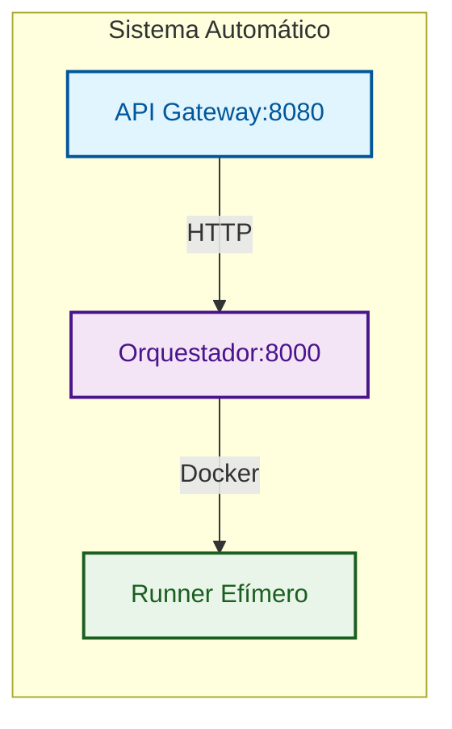
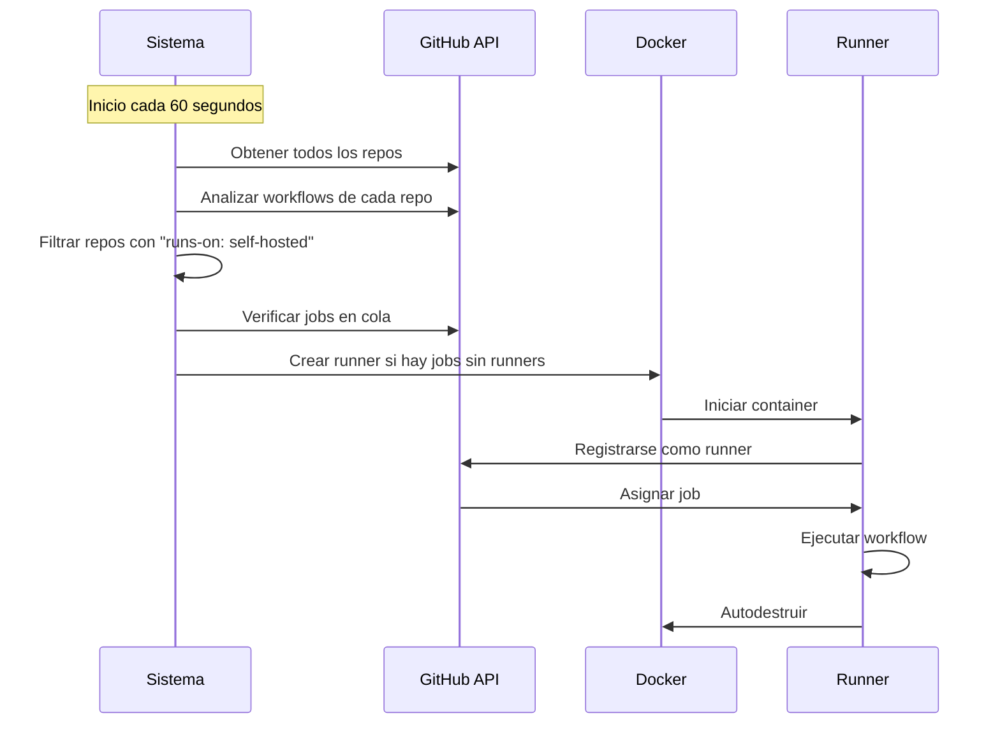

# GitHub Actions Ephemeral Runners

Plataforma para crear y destruir runners self-hosted de GitHub Actions de forma **EFIMERA y AUTOMÁTICA** usando contenedores Docker.

## 🚀 Características Principales

- **🏗️ Arquitectura Modular**: Estructura limpia, mantenible y escalable
- **🎯 Centralización de Versiones**: Single source of truth por servicio
- **📊 Logging Estandarizado**: Categorías y emojis consistentes en toda la arquitectura
- **🤖 Automático**: Descubre repos y crea runners sin configuración manual
- **🔄 Efímeros**: Crear → Usar → Destruir automáticamente
- **🔒 Seguros**: Tokens temporales, sin persistencia de datos sensibles
- **📈 Escalables**: Creación masiva de runners bajo demanda
- **🎯 Minimalistas**: Sin monitoreo ni métricas innecesarias
- **⚡ Repo-first**: Despliegue sin infraestructura previa
- **🚀 Deploy-Ready**: Configuración centralizada en deploy/

## 🏗️ Arquitectura



### Componentes

1. **API Gateway**: Punto de entrada HTTP público, validación y rate limiting
   - **Endpoints públicos**: `/api/v1/*`
   - **Validación**: Field validators en modelos Pydantic
   - **Respuestas**: Estandarizadas con `APIResponse`
   - **Logging**: Middleware optimizado con categorías y emojis

2. **Orquestador**: Gestión interna de runners, descubrimiento y ciclo de vida
   - **Endpoints internos**: `/runners/*` (solo para debugging)
   - **Monitoreo**: Automático si `AUTO_CREATE_RUNNERS=true`
   - **Confianza**: Asume datos validados del Gateway
   - **Logging**: Sistema estandarizado consistente

3. **Runner**: Contenedor efímero que ejecuta jobs y se autodestruye
   - **Imagen**: Configurable via `RUNNER_IMAGE`
   - **Aislamiento**: Contenedor Docker aislado
   - **Autodestrucción**: Eliminación automática post-job

### Flujo de Datos

```
Cliente → API Gateway → Orquestador → Docker
   ↓         ↓           ↓          ↓
Valida   Enruta     Gestiona   Crea
```

## 📁 Estructura del Proyecto

### 📦 Arquitectura Modular

```
gha-ephemeral-runners/
├── deploy/                    # 🚀 Configuración de despliegue
│   ├── compose.yaml          # Docker Compose actualizado
│   ├── .env.example           # Plantilla de configuración
│   └── .env                   # Variables de entorno
├── api-gateway/               # 🌐 Servicio Gateway (puerto 8080)
│   ├── docker/               # Configuración Docker específica
│   │   ├── Dockerfile
│   │   └── healthcheck.go
│   ├── scripts/              # Scripts del servicio
│   │   └── build.sh
│   ├── src/                  # Código fuente modular
│   │   ├── api/             # Endpoints y modelos
│   │   ├── core/            # Configuración y servicio
│   │   ├── middleware/      # Middleware de logging y errores
│   │   ├── services/       # Lógica de negocio
│   │   └── utils/          # Utilidades y helpers
│   ├── version.py           # 🎯 Single source of truth
│   ├── main.py              # Punto de entrada
│   └── requirements.txt     # Dependencias
├── orchestrator/              # 🔧 Servicio Orchestrator (puerto 8000)
│   ├── docker/               # Configuración Docker específica
│   │   ├── Dockerfile
│   │   └── healthcheck.go
│   ├── src/                  # Código fuente modular
│   │   ├── api/             # Endpoints y modelos
│   │   ├── core/            # Lógica principal
│   │   ├── services/       # Servicios de negocio
│   │   └── utils/          # Utilidades y helpers
│   ├── version.py           # 🎯 Single source of truth
│   ├── main.py              # Punto de entrada
│   └── requirements.txt     # Dependencias
├── scripts/                   # 🛠️ Scripts globales
│   └── update-version.py    # Actualización de versiones
├── .github/workflows/         # 🔄 CI/CD
│   └── build-and-release.yml # Build y release automatizado
└── README.md                  # 📚 Documentación principal
```

### 🎯 Roles de los Componentes

- **API Gateway**: Punto de entrada HTTP público, validación y rate limiting
- **Orquestador**: Gestión interna de runners, descubrimiento y ciclo de vida
- **Deploy**: Configuración centralizada de despliegue y variables de entorno
- **Scripts**: Utilidades globales de mantenimiento y automatización
- **CI/CD**: Build automatizado con versiones dinámicas y releases

## 🚀 Inicio Rápido

### ⚡ Modo Automático (Zero Configuration)

**Recomendado para la mayoría de usuarios - Sin configuración manual**

1. **Configurar variables**:
   ```bash
   cd deploy
   cp .env.example .env
   # Editar .env con tus valores:
   nano .env
   ```

2. **Configurar variables obligatorias en .env**:
   ```bash
   # Token de GitHub (obligatorio)
   GITHUB_RUNNER_TOKEN=ghp_tu_personal_access_token_aqui
   
   # Imagen de runners (obligatorio)
   RUNNER_IMAGE=myoung34/github-runner:latest
   
   # Registry (obligatorio)
   REGISTRY=localhost
   IMAGE_VERSION=latest
   
   # Automatización (opcional)
   AUTO_CREATE_RUNNERS=true
   RUNNER_CHECK_INTERVAL=60
   ```

3. **Inicia el sistema**:
   ```bash
   cd deploy
   docker compose up -d
   ```

4. **Verificar funcionamiento**:
   ```bash
   curl http://localhost:8080/health
   ```

**¡Listo! El sistema descubrirá automáticamente todos tus repos y creará runners cuando se necesiten.**

### 🔧 Modo Manual (Control Total)

**Para usuarios que quieren control total sobre la creación de runners**

1. **Configurar variables básicas**:
   ```bash
   cd deploy
   cp .env.example .env
   # Editar .env con valores básicos (sin automatización)
   ```

2. **Inicia el sistema**:
   ```bash
   cd deploy
   docker compose up -d
   ```

3. **Crea runners manualmente**:
   ```bash
   curl -X POST http://localhost:8080/api/v1/runners \
     -H "Content-Type: application/json" \
     -d '{"scope": "repo", "scope_name": "tu-repo/main", "count": 1}'
   ```

### 📋 Requisitos

- **Docker y Docker Compose**
- **Token de GitHub** con scopes: `repo`, `admin:org`, `workflow`
- **Registry** para imágenes (puede ser localhost para desarrollo)

## 🎯 Gestión de Versiones

### 🎯 Single Source of Truth

Cada servicio tiene su propio archivo `version.py` como fuente primaria de verdad:

```python
# api-gateway/version.py
"""API Gateway Version Management - Single Source of Truth."""
__version__ = "1.1.0"

# orchestrator/version.py  
"""Orchestrator Version Management - Single Source of Truth."""
__version__ = "1.1.0"
```

### 🔄 Actualización Automática

```bash
# Actualizar todos los servicios a la vez
python scripts/update-version.py 1.2.0

# Verificar versión actualizada
cd api-gateway && python -c "from version import __version__; print(f'API Gateway: {__version__}')"
cd orchestrator && python -c "from version import __version__; print(f'Orchestrator: {__version__}')"
```

### 🚀 CI/CD Integrado

El workflow inyecta automáticamente la versión en build time:

```yaml
# .github/workflows/build-and-release.yml
build-args: APP_VERSION=${{ github.ref_name }}
```

**Resultados:**
- **Docker labels**: `version=1.1.0` dinámico
- **API responses**: Versión correcta en health checks
- **Consistencia**: Mismo sistema en desarrollo y producción

## 📊 Logging Estandarizado

### 🎨 Sistema de Categorías

El sistema usa categorías con emojis para consistencia en toda la arquitectura:

```python
LOG_CATEGORIES = {
    'START': '🚀 INICIO',
    'CONFIG': '⚙️ CONFIG', 
    'MONITOR': '🔄 MONITOREO',
    'SUCCESS': '✅ ÉXITO',
    'ERROR': '❌ ERROR',
    'WARNING': '⚠️ ADVERTENCIA',
    'INFO': '📋 INFO',
    'REQUEST': '🌐 REQUEST',
    'RESPONSE': '📤 RESPONSE',
    'HEALTH': '💚 HEALTH',
    'SHUTDOWN': '🛑 SHUTDOWN'
}
```

### 🔧 Middleware Optimizado

- **Health checks internos**: Sin logs REQUEST/RESPONSE para reducir ruido
- **Solicitudes externas**: Logging completo con formato estandarizado
- **Consistencia**: Mismo formato en API Gateway y Orchestrator

**Ejemplos de logs:**
```
🚀 INICIO API Gateway Service
⚙️ CONFIG Orquestador configurado: http://orchestrator:8000
🌐 REQUEST Solicitud recibida: POST http://localhost:8080/api/v1/runners - IP: 192.168.1.100
📤 RESPONSE Respuesta enviada: Status: 201 - Duración: 0.245s
💚 HEALTH Gateway funcionando correctamente
```

## 🌐 Configuración de Redes y Proxy

### Configuración con Nginx Proxy Manager

Para despliegue en producción con dominio personalizado:

#### 1. Proxy Host
- **Domain**: `gha.yourdomain.com`
- **Scheme**: `http`
- **Forward Hostname/IP**: `localhost`
- **Forward Port**: `8080`

#### 2. SSL Certificate
- Habilitar SSL Certificate
- Seleccionar certificado Let's Encrypt

#### 3. Configuración CORS
```bash
# En deploy/.env para producción con dominio específico
CORS_ORIGINS=https://yourdomain.com

# Para desarrollo local/red (acepta cualquier origen)
CORS_ORIGINS=*
```

#### 4. URLs de Acceso
Una vez configurado:
- **API Gateway**: `https://gha.yourdomain.com`
- **Documentación**: `https://gha.yourdomain.com/docs`
- **Health Check**: `https://gha.yourdomain.com/health`

### 🔄 Configurar Puerto Personalizado

```bash
# Edita deploy/compose.yaml y cambia:
# ports:
#   - "9000:8080"  # Puerto host según necesites

cd deploy
docker compose up -d
curl http://localhost:8080/health
```

## 🎯 Uso en Workflows

```yaml
# .github/workflows/ci.yml
name: CI
on: [push, workflow_dispatch]

jobs:
  build:
    runs-on: self-hosted  # ← Runner creado automáticamente o manualmente
    steps:
      - uses: actions/checkout@v5
      - name: Build and Test
        run: |
          echo "Running on ephemeral runner!"
          # tus comandos de build/test
```

## 🔑 Token de GitHub

### 🔑 Scopes Requeridos

- **`repo`** - Acceso completo a repositorios
- **`admin:org`** - Administración de organización
- **`workflow`** - Ejecutar workflows de GitHub Actions

### 🔧 Creación del Token

1. **Ve a GitHub Settings** → Developer settings → Personal access tokens → Tokens (classic)
2. **Generate New Token** → Note: "GHA Ephemeral Runners"
3. **Seleccionar Scopes**: `repo`, `admin:org`, `workflow`
4. **Generate y Copiar** el token inmediatamente

### ⚙️ Configuración

```bash
# En deploy/.env
GITHUB_RUNNER_TOKEN=ghp_tu_personal_access_token_aqui
```

## 🤖 Modo Automático: Descubrimiento Inteligente

### 🔄 ¿Cómo funciona?

El sistema descubre automáticamente todos tus repositorios y crea runners cuando se necesitan:



### 📋 Flujo Automático

1. **🔍 Descubrimiento**: Obtiene todos tus repositorios (personales y de organización)
2. **📂 Análisis**: Descarga y analiza los archivos `.github/workflows/*.yml`
3. **🎯 Detección**: Identifica repos que usan `runs-on: self-hosted`
4. **⏱️ Monitoreo**: Cada 60 segundos verifica si hay jobs en cola
5. **🚀 Creación**: Crea runners automáticamente si hay jobs en cola
6. **🧹 Limpieza**: Los runners se autodestruyen después de completar los jobs

### ⚙️ Configuración de Automatización

```bash
# En deploy/.env
AUTO_CREATE_RUNNERS=true              # Activar automatización
RUNNER_CHECK_INTERVAL=60              # Verificar cada 60 segundos
DISCOVERY_MODE=all                    # 'all' (todos) o 'organization'
```

## 📚 Endpoints de la API

### API Gateway (Puerto 8080)

| Endpoint | Método | Descripción |
|----------|--------|-------------|
| `/api/v1/runners` | POST | Crear runners efímeros |
| `/api/v1/runners` | GET | Listar todos los runners activos |
| `/api/v1/runners/{id}` | GET | Ver estado de un runner específico |
| `/api/v1/runners/{id}` | DELETE | Destruir un runner específico |
| `/api/v1/runners/cleanup` | POST | Limpiar runners inactivos |
| `/health` | GET | Health check básico |
| `/api/v1/health` | GET | Health check completo |
| `/healthz` | GET | Health check para Docker |
| `/docs` | GET | Documentación Swagger UI |
| `/redoc` | GET | Documentación ReDoc |

### Health Checks

El sistema incluye múltiples endpoints de verificación:
- **Básico**: `/health` - Estado simple del gateway
- **Completo**: `/api/v1/health` - Incluye estado del orquestador
- **Docker**: `/healthz` - Para orquestación de contenedores (sin logs verbosos)

## 🔧 Variables de Entorno

### Obligatorias
- `GITHUB_RUNNER_TOKEN`: Token de GitHub para gestión de runners
- `REGISTRY`: URL de tu registry (puede ser localhost para desarrollo)
- `IMAGE_VERSION`: Versión de imágenes (latest para desarrollo)
- `RUNNER_IMAGE`: Imagen Docker para runners

### Automatización (Opcional)
- `AUTO_CREATE_RUNNERS`: Activar creación automática (`true`/`false`, default: `false`)
- `RUNNER_CHECK_INTERVAL`: Intervalo de verificación en segundos (default: `60`)
- `DISCOVERY_MODE`: Modo de descubrimiento (`all`/`organization`, default: `all`)

### Opcionales
- `CORS_ORIGINS`: Orígenes permitidos para CORS (default: `"*"`)
  - Producción: `https://yourdomain.com`
  - Desarrollo: `*`
- `API_GATEWAY_PORT`: Puerto interno del contenedor API Gateway (default: `8080`)
- `ORCHESTRATOR_PORT`: Puerto interno del contenedor Orchestrator (default: `8000`)

## 🌐 Requisitos de Infraestructura

- **Puertos**: API Gateway (8080), Orchestrator (8000) - solo internos
- **Proxy**: Requerido reverse proxy (nginx/traefik) para exposición pública
- **NAT**: Puede operar detrás de NAT sin puertos publicados
- **Docker**: Engine 20.10+ con soporte para redes overlay

## 🔒 Seguridad

- **Tokens temporales**: Registration tokens con expiración rápida
- **Aislamiento**: Runners en contenedores Docker aislados
- **Sin persistencia**: No se almacenan tokens sensibles

## 🔄 CI/CD y Build

### 🔄 Build and Release Workflow

**Trigger**: Tags con prefijo `v*` (ej: `v1.2.3`)

**Funcionalidades:**
- **Build x86_64**: Construye imágenes para `linux/amd64`
- **Context corregido**: `orchestrator/docker` y `api-gateway/docker`
- **Versiones dinámicas**: Build args `APP_VERSION=${{ github.ref_name }}`
- **Tags dobles**: Publica con tags `:latest` y `:versión`
- **Changelog automático**: Genera changelog desde el tag anterior
- **GitHub Release**: Crea release con changelog incluido

**Imágenes generadas:**
```
your-registry.com/gha-orchestrator:latest
your-registry.com/gha-orchestrator:v1.2.3

your-registry.com/gha-api-gateway:latest
your-registry.com/gha-api-gateway:v1.2.3
```

### 🛠️ Scripts de Build y Versión

Cada servicio tiene sus propios scripts independientes:

```bash
# API Gateway
cd api-gateway/scripts
./build.sh [registry] [version]    # Build Docker
./versioning.sh [version]         # Actualizar version.py

# Orchestrator  
cd orchestrator/scripts
./build.sh [registry] [version]    # Build Docker
./versioning.sh [version]         # Actualizar version.py
```

**Ejemplos de uso:**
```bash
# Usar defaults (localhost, latest)
./build.sh
./versioning.sh

# Especificar valores
./build.sh myreg.com 1.2.0
./versioning.sh 1.2.0

# Con variables de entorno
REGISTRY=myreg.com IMAGE_VERSION=1.2.0 ./build.sh
```

### 🛠️ Comandos Útiles

```bash
# Crear release
git tag v1.2.0
git push origin v1.2.0

# Build local con scripts
cd api-gateway/scripts && ./build.sh localhost 1.2.0
cd orchestrator/scripts && ./build.sh localhost 1.2.0
```

## 📄 Licencia

MIT License - ver archivo LICENSE para detalles.
