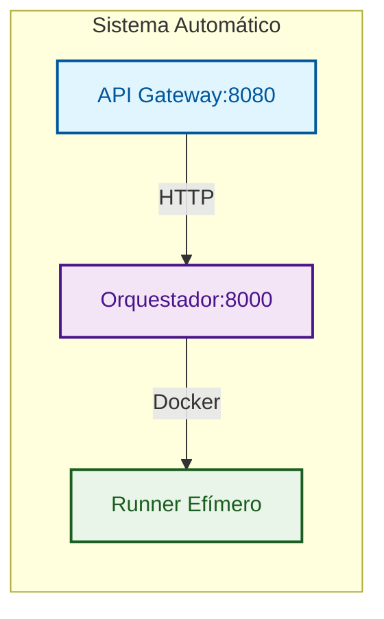
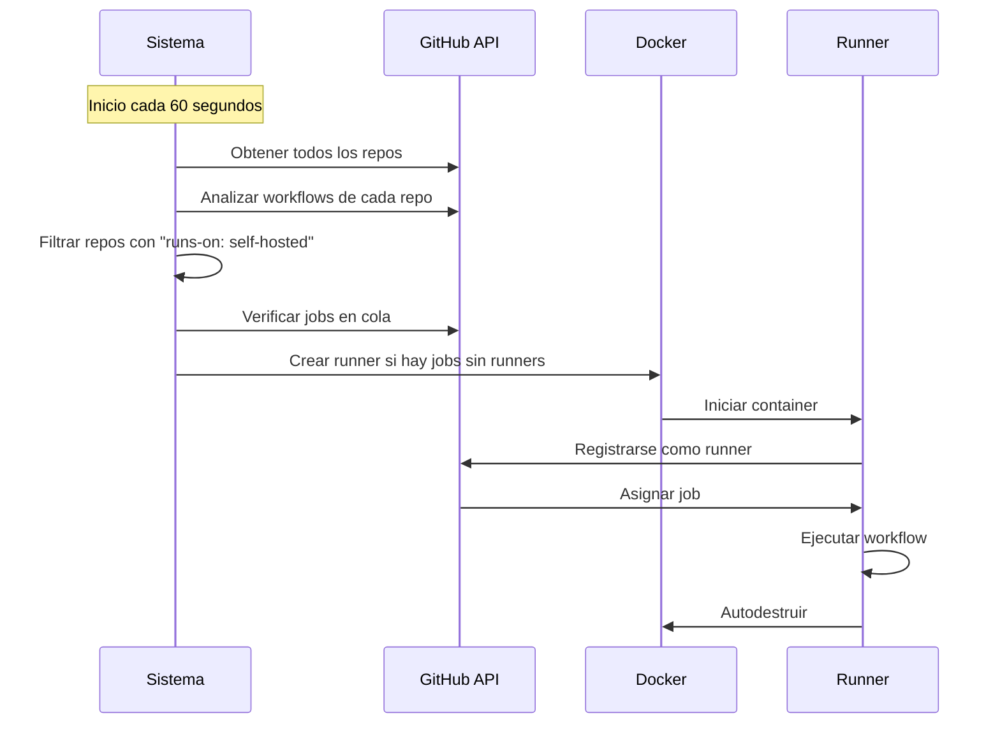

# GitHub Actions Ephemeral Runners

Plataforma para crear y destruir runners self-hosted de GitHub Actions de forma **EFIMERA y AUTOMÁTICA** usando contenedores Docker.

## 🚀 Características Principales

- **🤖 Automático**: Descubre repos y crea runners sin configuración manual
- **🔄 Efímeros**: Crear → Usar → Destruir automáticamente
- **🔒 Seguros**: Tokens temporales, sin persistencia de datos sensibles
- **📈 Escalables**: Creación masiva de runners bajo demanda
- **🎯 Minimalistas**: Sin monitoreo ni métricas innecesarias
- **⚡ Repo-first**: Despliegue sin infraestructura previa
- **📦 Registry-ready**: Compatible con registry privado

## 🏗️ Arquitectura



### Componentes

1. **API Gateway**: Punto de entrada HTTP público, validación y rate limiting
   - **Endpoints públicos**: `/api/v1/*`
   - **Validación**: Field validators en modelos Pydantic
   - **Respuestas**: Estandarizadas con `APIResponse`

2. **Orquestador**: Gestión interna de runners, descubrimiento y ciclo de vida
   - **Endpoints internos**: `/runners/*` (solo para debugging)
   - **Monitoreo**: Automático si `AUTO_CREATE_RUNNERS=true`
   - **Confianza**: Asume datos validados del Gateway

3. **Runner**: Contenedor efímero que ejecuta jobs y se autodestruye
   - **Imagen**: Configurable via `RUNNER_IMAGE`
   - **Aislamiento**: Contenedor Docker aislado
   - **Autodestrucción**: Eliminación automática post-job

### Flujo de Datos

```
Cliente → API Gateway → Orquestador → Docker
   ↓         ↓           ↓          ↓
Valida   Enruta     Gestiona   Crea
```

- **API Gateway**: Valida y enruta solicitudes
- **Orquestador**: Gestiona ciclo de vida de runners
- **Docker**: Ejecuta contenedores efímeros

## 🚀 Inicio Rápido

### ⚡ Modo Automático (Zero Configuration)

**Recomendado para la mayoría de usuarios - Sin configuración manual**

1. **Configurar variables**:
   ```bash
   echo "GITHUB_RUNNER_TOKEN=ghp_tu_token" > .env
   echo "AUTO_CREATE_RUNNERS=true" >> .env
   echo "RUNNER_CHECK_INTERVAL=60" >> .env
   echo "REGISTRY=your-registry.com" >> .env
   echo "IMAGE_VERSION=latest" >> .env
   echo "RUNNER_IMAGE=your-registry.com/gha-runner:latest" >> .env
   ```

2. **Inicia el sistema**:
   ```bash
   docker compose up -d
   ```

3. **Verificar funcionamiento**:
   ```bash
   curl http://localhost:8080/health
   ```

**¡Listo! El sistema descubrirá automáticamente todos tus repos y creará runners cuando se necesiten.**

### 🔧 Modo Manual (Control Total)

**Para usuarios que quieren control total sobre la creación de runners**

1. **Configurar variables**:
   ```bash
   echo "GITHUB_RUNNER_TOKEN=ghp_tu_token" > .env
   echo "REGISTRY=your-registry.com" >> .env
   echo "IMAGE_VERSION=latest" >> .env
   echo "RUNNER_IMAGE=your-registry.com/gha-runner:latest" >> .env
   ```

2. **Inicia el sistema**:
   ```bash
   docker compose up -d
   ```

3. **Crea runners manualmente**:
   ```bash
   curl -X POST http://localhost:8080/api/v1/runners/create \
     -H "Content-Type: application/json" \
     -d '{"scope": "repo", "scope_name": "tu-repo/main", "count": 1}'
   ```

### 📋 Requisitos

- **Docker y Docker Compose**
- **Token de GitHub** con scopes: `repo`, `admin:org`, `workflow`
- **Registry privado** con imágenes: `gha-orchestrator`, `gha-api-gateway`

## 🌐 Configuración de Redes y Proxy

### Configuración con Nginx Proxy Manager

Para despliegue en producción con dominio personalizado:

#### 1. Proxy Host
- **Domain**: `gha.yourdomain.com`
- **Scheme**: `http`
- **Forward Hostname/IP**: `localhost`
- **Forward Port**: `8080`

#### 2. SSL Certificate
- Habilitar SSL Certificate
- Seleccionar certificado Let's Encrypt

#### 3. Configuración CORS
```bash
# Para producción con dominio específico
CORS_ORIGINS=https://yourdomain.com

# Para desarrollo local/red (acepta cualquier origen)
# CORS_ORIGINS=*
```

#### 4. URLs de Acceso
Una vez configurado:
- **API Gateway**: `https://gha.yourdomain.com`
- **Documentación**: `https://gha.yourdomain.com/docs`
- **Health Check**: `https://gha.yourdomain.com/health`

### 🔄 Configurar Puerto Personalizado

```bash
# Edita compose.yaml y cambia:
# ports:
#   - "9000:8080"  # Puerto host según necesites

docker compose up -d
curl http://localhost:8080/health
```

### 🎯 Uso en Workflows

```yaml
# .github/workflows/ci.yml
name: CI
on: [push, workflow_dispatch]

jobs:
  build:
    runs-on: self-hosted  # ← Runner creado automáticamente o manualmente
    steps:
      - uses: actions/checkout@v5
      - name: Build and Test
        run: |
          echo "Running on ephemeral runner!"
          # tus comandos de build/test
```

## 🔑 Token de GitHub

### 🔑 Scopes Requeridos

- **`repo`** - Acceso completo a repositorios
- **`admin:org`** - Administración de organización
- **`workflow`** - Ejecutar workflows de GitHub Actions

### 🔧 Creación del Token

1. **Ve a GitHub Settings** → Developer settings → Personal access tokens → Tokens (classic)
2. **Generate New Token** → Note: "GHA Ephemeral Runners"
3. **Seleccionar Scopes**: `repo`, `admin:org`, `workflow`
4. **Generate y Copiar** el token inmediatamente

### ⚙️ Configuración

```bash
# En tu .env
GITHUB_RUNNER_TOKEN=ghp_tu_personal_access_token_aqui
```

## 🤖 Modo Automático: Descubrimiento Inteligente

### 🔄 ¿Cómo funciona?

El sistema descubre automáticamente todos tus repositorios y crea runners cuando se necesitan:



### 📋 Flujo Automático

1. **🔍 Descubrimiento**: Obtiene todos tus repositorios (personales y de organización)
2. **📂 Análisis**: Descarga y analiza los archivos `.github/workflows/*.yml`
3. **🎯 Detección**: Identifica repos que usan `runs-on: self-hosted`
4. **⏱️ Monitoreo**: Cada 60 segundos verifica si hay jobs en cola
5. **🚀 Creación**: Crea runners automáticamente si hay jobs en cola
6. **🧹 Limpieza**: Los runners se autodestruyen después de completar los jobs

### ⚙️ Configuración de Automatización

```bash
# .env
AUTO_CREATE_RUNNERS=true              # Activar automatización
RUNNER_CHECK_INTERVAL=60              # Verificar cada 60 segundos
DISCOVERY_MODE=all                    # 'all' (todos) o 'organization'
```

## 🎯 Uso Práctico

### 📋 Conectar tu Repositorio

1. **Ve a tu repositorio en GitHub**
2. **Settings → Actions → Runners** (verás "No self-hosted runners")
3. **Crea workflow** `.github/workflows/ci.yml`:
   ```yaml
   name: CI/CD
   on:
     push:
       branches: [ main ]
   jobs:
     build:
       runs-on: self-hosted
       steps:
       - uses: actions/checkout@v5
       - name: Build
         run: echo "Running on ephemeral runner!"
   ```

### 🔍 Verificación

```bash
# Ver runners activos
curl http://localhost:8080/api/v1/runners

# Ver salud del sistema
curl http://localhost:8080/api/v1/health

# Ver logs
docker compose logs -f orchestrator
```

## 📚 Endpoints de la API

### API Gateway (Puerto 8080)
| Endpoint | Método | Descripción |
|----------|--------|-------------|
| `/api/v1/runners` | POST | Crear runners efímeros |
| `/api/v1/runners` | GET | Listar todos los runners activos |
| `/api/v1/runners/{id}` | GET | Ver estado de un runner específico |
| `/api/v1/runners/{id}` | DELETE | Destruir un runner específico |
| `/api/v1/runners/cleanup` | POST | Limpiar runners inactivos |
| `/health` | GET | Health check básico |
| `/api/v1/health` | GET | Health check completo |
| `/docs` | GET | Documentación Swagger UI |
| `/redoc` | GET | Documentación ReDoc |

### Health Checks
El sistema incluye múltiples endpoints de verificación:
- **Básico**: `/health` - Estado simple del gateway
- **Completo**: `/api/v1/health` - Incluye estado del orquestador
- **Docker**: `/healthz` - Para orquestación de contenedores

## 🔧 Variables de Entorno

### Obligatorias
- `GITHUB_RUNNER_TOKEN`: Token de GitHub para gestión de runners
- `REGISTRY`: URL de tu registry privado
- `IMAGE_VERSION`: Versión de imágenes
- `RUNNER_IMAGE`: Imagen Docker para runners (ej: `your-registry.com/gha-runner:latest`)

### Automatización (Opcional)
- `AUTO_CREATE_RUNNERS`: Activar creación automática (`true`/`false`, default: `false`)
- `RUNNER_CHECK_INTERVAL`: Intervalo de verificación en segundos (default: `300`)
- `DISCOVERY_MODE`: Modo de descubrimiento (`all`/`organization`, default: `all`)

### Opcionales
- `CORS_ORIGINS`: Orígenes permitidos para CORS (default: "*" - acepta cualquier origen)
  - Producción: `https://yourdomain.com`
  - Desarrollo: `*`

## 🔒 Seguridad

- **Tokens temporales**: Los registration tokens expiran rápidamente
- **Sin persistencia**: Ningún token sensible persiste en contenedores
- **Aislamiento**: Cada runner es un contenedor aislado
- **Autenticación opcional**: API Gateway puede requerir API key

## 📄 Licencia

MIT License - ver archivo LICENSE para detalles.
