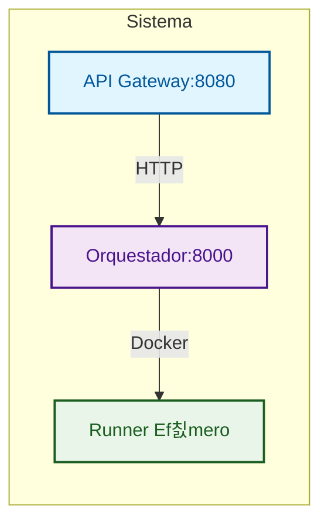
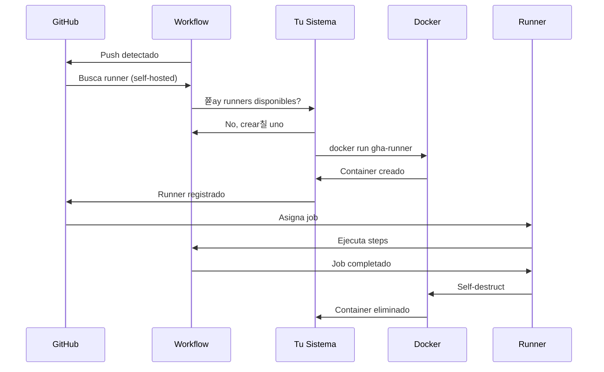

# GitHub Actions Ephemeral Runners

Plataforma para crear y destruir runners self-hosted de GitHub Actions de forma EFIMERA usando contenedores Docker.

## Características

- **Efímeros**: Crear -> Usar -> Destruir automáticamente
- **Seguros**: Tokens temporales, sin persistencia de datos sensibles
- **Escalables**: Creación masiva de runners bajo demanda
- **Minimalistas**: Sin monitoreo ni métricas innecesarias
- **Repo-first**: Despliegue sin infraestructura previa
- **Registry-ready**: Compatible con registry privado

## Arquitectura



### Componentes

1. **API Gateway**: Punto de entrada HTTP, autenticación y rate limiting
2. **Orquestador**: Genera tokens, crea contenedores, gestiona ciclo de vida
3. **Runner**: Contenedor efímero que ejecuta jobs y se autodestruye

## [Rocket] Inicio Rápido

### Requisitos Mínimos

- Docker y Docker Compose
- Token de GitHub con scopes: `repo`, `admin:org`, `workflow`
- Registry privado con imágenes: `gha-runner`, `gha-orchestrator`, `gha-api-gateway`

### 4 Pasos para Empezar

1. **Configurar token**:
   ```bash
   echo "GITHUB_TOKEN=ghp_tu_token" > .env
   ```

2. **Inicia el sistema**:
   ```bash
   docker compose up -d
   ```

3. **Verificar funcionamiento**:
   ```bash
   curl http://localhost:8080/health
   ```

4. **Usar en tu workflow**:
   ```yaml
   # .github/workflows/ci.yml
   name: CI
   on: [push]
   jobs:
     build:
       runs-on: self-hosted  # <- ¡Esto es todo!
       steps:
       - uses: actions/checkout@v4
       - run: echo "Running on ephemeral runner!"
   ```

5. **Hacer push y ver la magia**:
   ```bash
   git push origin main
   ```

## [Package] Instalación Completa

### Opción 1: Usando imágenes del Registry (Recomendado)

1. **Clonar repositorio**:
   ```bash
   git clone <repository-url>
   cd gha-ephemeral-runners
   ```

2. **Configurar variables de entorno**:
   ```bash
   cp .env.example .env
   # Editar .env con tu configuración:
   # - GITHUB_TOKEN: Token de GitHub
   # - REGISTRY: Tu registry privado
   ```

3. **Desplegar**:
   ```bash
   docker compose up -d
   ```

### Opción 2: Build local

1. **Configurar variables de entorno**:
   ```bash
   cp .env.example .env
   # Editar .env con tu configuración
   ```

2. **Construir imágenes**:
   ```bash
   # Precondición: docker login your-registry.com
   python build_and_push.py
   ```

## [Tool] Token de GitHub

### 쯈ué tipo de token necesitas?

**Personal Access Token (PAT)** con los siguientes scopes:
- `repo` - Acceso completo a repositorios
- `admin:org` - Administración de organización
- `workflow` - Ejecutar workflows de GitHub Actions

### 쮺칩mo obtener el token?

1. **Ve a GitHub Settings** -> Developer settings -> Personal access tokens -> Tokens (classic)
2. **Generate New Token** -> Note: "GHA Ephemeral Runners"
3. **Seleccionar Scopes**: `repo`, `admin:org`, `workflow`
4. **Generate y Copiar** el token inmediatamente

### Uso del Token

```bash
# En tu .env
GITHUB_TOKEN=ghp_tu_personal_access_token_aqui
```

**El sistema usa tu PAT para:**
1. Generar tokens temporales para cada runner
2. Registrar runners en GitHub
3. Gestionar ciclo de vida completo

**Seguridad:**
- Tu PAT solo existe en el orquestador
- Los runners usan tokens temporales
- Sin persistencia en logs o imágenes
- Puedes rotar tu PAT sin afectar runners activos

## [Target] Uso Práctico

### Conectar tu Repositorio

#### Para Repositorio Específico

1. **Ve a tu repositorio en GitHub**
2. **Settings -> Actions -> Runners** (verás "No self-hosted runners")
3. **Crea workflow** `.github/workflows/ci.yml`:
   ```yaml
   name: CI/CD
   on:
     push:
       branches: [ main ]
   jobs:
     build:
       runs-on: self-hosted
       steps:
       - uses: actions/checkout@v4
       - name: Build
         run: echo "Running on ephemeral runner!"
   ```

#### Para Organización

1. **Ve a tu organización en GitHub**
2. **Settings -> Actions -> Runner groups** -> Crea nuevo grupo
3. **Asigna repositorios al grupo**
4. **Usa `runs-on: self-hosted` en workflows**

### 쯈ué sucede cuando haces push?



### Verificación

```bash
# Ver runners activos
curl http://localhost:8080/api/v1/runners

# Ver salud del sistema
curl http://localhost:8080/api/v1/health

# Ver logs
docker compose logs -f orchestrator
```

## [API] API Reference

### [Target] Arquitectura de Endpoints

#### **Orquestador (Puerto 8000) - Motor Interno**
| Endpoint | Método | Propósito |
|----------|--------|-----------|
| `/runners/create` | POST | **Crear runners** - Genera 1-10 runners efímeros |
| `/runners/{runner_id}/status` | GET | **Ver estado** - Estado específico de un runner |
| `/runners/{runner_id}` | DELETE | **Destruir runner** - Eliminar runner específico |
| `/runners` | GET | **Listar runners** - Todos los runners activos |
| `/runners/cleanup` | POST | **Limpiar inactivos** - Eliminar runners muertos |
| `/health` | GET | **Health check** - Estado del orquestador |

**[Tool] Funciones Clave del Orquestador:**
- **Gestión de tokens**: Genera registration tokens temporales
- **Ciclo de vida**: Crea, monitorea y destruye contenedores
- **Monitoreo automático**: Background tasks para limpieza
- **Integración Docker**: Gestión directa de contenedores

#### **[Globe] API Gateway (Puerto 8080) - Fachada Pública**
| Endpoint | Método | Propósito |
|----------|--------|-----------|
| `/api/v1/runners` | POST | **Crear runners** - Proxy al orquestador |
| `/api/v1/runners/{runner_id}` | GET | **Ver estado** - Proxy al orquestador |
| `/api/v1/runners/{runner_id}` | DELETE | **Destruir runner** - Proxy al orquestador |
| `/api/v1/runners` | GET | **Listar runners** - Proxy al orquestador |
| `/api/v1/runners/cleanup` | POST | **Limpiar inactivos** - Proxy al orquestador |
| `/health` | GET | **Health básico** - Estado del gateway |
| `/api/v1/health` | GET | **Health completo** - Gateway + orquestador |
| `/docs` | GET | **Documentación** - Swagger UI |
| `/redoc` | GET | **Documentación** - ReDoc |

**[Shield] Funciones Clave del API Gateway:**
- **Autenticación**: API key opcional
- **Rate limiting**: Límite de solicitudes
- **Logging**: Registro de todas las peticiones
- **CORS**: Soporte para cross-origin
- **Manejo de errores**: Respuestas estandarizadas
- **Documentación**: Swagger/OpenAPI automática

### Endpoints Principales

#### `POST /api/v1/runners`
Crea uno o más runners efímeros.

```bash
curl -X POST http://localhost:8080/api/v1/runners \
  -H 'Content-Type: application/json' \
  -d '{
    "scope": "repo",
    "scope_name": "owner/repo",
    "runner_name": "my-runner",
    "labels": ["linux", "x64", "self-hosted"],
    "count": 1
  }'
```

**Parámetros:**
- `scope`: `"repo"` o `"org"`
- `scope_name`: `"owner/repo"` o `"organization"`
- `runner_name`: Nombre único (opcional)
- `labels`: Lista de labels (opcional)
- `count`: Número de runners (1-10, default: 1)

#### `GET /api/v1/runners`
Lista todos los runners activos.

```bash
curl http://localhost:8080/api/v1/runners
```

#### `DELETE /api/v1/runners/{runner_id}`
Elimina un runner específico.

```bash
curl -X DELETE http://localhost:8080/api/v1/runners/runner-123
```

#### `POST /api/v1/runners/cleanup`
Limpia runners inactivos automáticamente.

```bash
curl -X POST http://localhost:8080/api/v1/runners/cleanup
```

#### `GET /health` y `GET /api/v1/health`
Verificación de salud del sistema.

```bash
curl http://localhost:8080/health
curl http://localhost:8080/api/v1/health
```

## [Lock] Configuración Avanzada

### Nginx Proxy Manager (Producción)

Para producción, usa Nginx Proxy Manager:

1. **Configurar Proxy Host**:
   - Domain: `gha.yourdomain.com`
   - Forward Port: `8080`
   - SSL Certificate: Habilitar

2. **Autenticación**:
   - Habilitar "Require Authentication"
   - Crear usuario/contraseña

3. **Configurar .env**:
   ```bash
   ENABLE_AUTH=false  # El proxy maneja la autenticación
   ```

### Variables de Entorno

#### Obligatorias
- `GITHUB_TOKEN`: Token de GitHub con permisos
- `REGISTRY`: URL de tu registry privado

#### Opcionales
- `API_KEY`: Clave para autenticación del API Gateway
- `ENABLE_AUTH`: Habilitar autenticación (default: false)
- `MAX_REQUESTS`: Límite de rate limiting (default: 100)
- `RATE_WINDOW`: Ventana de rate limiting (default: 60)
- `IMAGE_VERSION`: Versión de imágenes (default: latest)
- `RUNNER_IMAGE`: Imagen para runners (usa ${REGISTRY}/gha-runner:${IMAGE_VERSION})

> **Nota**: Las variables `PORT` y `ORCHESTRATOR_URL` están hardcoded en docker-compose.yml y no necesitan configurarse en el .env.

### Build and Push Script

Script para construir y subir imágenes Docker al registry.

#### Uso Local

```bash
# Precondición: docker login your-registry.com
python build_and_push.py

# Opciones:
--verify-only              # Solo verificar imágenes
--dry-run                  # Simular ejecución
--cleanup                  # Limpiar imágenes después
```

#### Uso con GitHub Actions

Para automatizar el build y push, usa el workflow `.github/workflows/build-and-push.yml`:

```bash
# Crear tag y disparar workflow
git tag v1.0.0
git push origin v1.0.0
```

**Configuración requerida en GitHub:**
- **Secrets**: `REGISTRY_USERNAME`, `REGISTRY_PASSWORD`
- **Variables**: `REGISTRY`

Ver más detalles en [`.github/workflows/README.md`](./.github/workflows/README.md).

## 🔍 Troubleshooting

### Runner no se registra

1. **Verificar token**:
   ```bash
   curl http://localhost:8080/api/v1/health
   echo $GITHUB_TOKEN  # 쯊iene scopes correctos?
   ```

2. **Revisar logs**:
   ```bash
   docker compose logs orchestrator
   ```

3. **Confirmar scope_name**:
   - Formato: `owner/repo` para repos
   - Formato: `organization` para orgs

### Contenedor no se inicia

1. **Verificar Docker**:
   ```bash
   docker --version
   docker info
   ```

2. **Verificar imágenes**:
   ```bash
   docker images | grep gha-
   ```

3. **Revisar logs de construcción**:
   ```bash
   docker compose build
   ```

### API Gateway no responde

1. **Verificar puerto**:
   ```bash
   netstat -tlnp | grep 8080
   ```

2. **Verificar logs**:
   ```bash
   docker compose logs api-gateway
   ```

3. **Probar health check**:
   ```bash
   curl http://localhost:8080/health
   ```

### Monitoreo y Logs

```bash
# Logs del sistema
docker compose logs -f

# Logs específicos
docker compose logs -f api-gateway
docker compose logs -f orchestrator

# Logs de runner específico
docker logs runner-abc123

# Ver runners activos
curl http://localhost:8080/api/v1/runners
```

## [VS] Ventajas vs Runner Tradicional

| Runner Tradicional | Esta Solución |
|-------------------|---------------|
| Manual | Automático |
| Siempre encendido | Efímero |
| Costo constante | Pago por uso |
| Mantenimiento manual | Cero mantenimiento |
| Un solo runner | Infinitos runners |

## [List] 쮺uándo usar esta solución?

[OK] **Perfecto para**:
- Proyectos con builds intermitentes
- Equipos pequeños/medianos
- Ahorro de costos
- CI/CD moderno

[X] **No ideal para**:
- Builds que necesitan estado persistente
- Requisitos de compliance muy estrictos
- Necesidad de runners dedicados 24/7

## [Secure] Seguridad

- **Tokens temporales**: Los registration tokens expiran rápidamente
- **Sin persistencia**: Ningún token sensible persiste en contenedores
- **Aislamiento**: Cada runner es un contenedor aislado
- **Autenticación opcional**: API Gateway puede requerir API key

## [Doc] Licencia

MIT License - ver archivo LICENSE para detalles.
